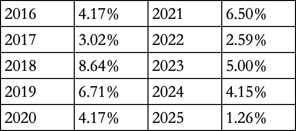

# 挤压

先顺着昨晚的文章说吧，我说2016年的房子原价卖出亏500万，很多读者表示不能理解，行，我把帐算的清楚一些。

50万买的车位附赠这个不解释了。

1400万的房子，贷款900万，当年利率优惠85折，4.17%。2016年10月开始付的，去年我让老婆提前还了大部分，我让ai计算9年时间累计支付的利息，结果是309万。

当初首付500万，如果不买房的话这钱会买灵活变现的公募债，我以前在公众号多次推荐过的那个（现在不能说具体名字），这个债基从2016年至今的逐年收益率如下表，如果500万首付2016年放进去，现在是783万，盈利283万。这不是假设，我们家这些年的闲置零钱就是这么买的。

所以50万（车位）+309万（房贷利息）+283万（首付10年成本）=642万，这是真实的，独立于房价之外的财务成本。

我们全家在2018年收房入住，住了8年，同期租金大约是200万，把这一块减掉，642-200=442万。所以我昨天说亏300万实际上还算少了。

这才是真实的，合理的账本，有些人全款买房，没付利息，10年房价持平就说自己没亏，难道你的全款资金10年机会成本是零吗？

……

我估计很多读者看到上面这个表格后会有些意外，债基的收益比想象的要高，10年累计56%，年化复利是4.6%左右。

巧合的是，如果你2016年初买入沪深300指数ETF，持有到现在也差不多是55%，和债基的回报率不相上下。但两者的持有体验相去甚远，持有沪深300这10年你要经历两次巨大回撤，最大回撤45%，而持有债基的话每一个自然年都是盈利的，不用操心选股也不用担心买卖时机，你可以真正放心的把家庭大额资金投入。

从夏普率的角度看，投资债基完全碾压投资沪深300，事实上这也是我一直以来的观点，中国的债券性价比远远好于股市。a股长期以来的回报率和债券不相上下，但却有接近10倍的波动率，也正因为这样的特性，中国股市的主旋律是价格投机，不是长线价投。

但是，注意有但是，这个情况从2024年开始有了重大变化，中国银行开始暴力降息，因为房奴们扛不动月供了，几轮降息后债券收益率也不行了，你们看表格里的收益去年只有1%出头，今年（2026）也好不到哪去，不到2%。

这背后的本质，中国债市长期的高收益率是建立在房地产的持续繁荣上的，地产不行了，整个社会对资金的需求就下降了，不再愿意支付那么高的利息，所以债市旱涝保收的好日子可能也到头了。

接下来要么忍受不到2%的收益，要么就去股市冒风险拼命。银行理财也是一样的道理，因为银行理财的底层资产基本上也都是债券。央行降息的目的就是要把债市资金挤出来，催促你去消费，或者去投资。

……

今天a股成交2.03万亿，大部分指数都下跌，但呈现资金向头脚两端倾斜的罕见情况，即头部的上证50和脚部的微盘股都是红的，但中间的所有指数都绿了。其中科创是跌最多的，因为今天科技板块整体表现最弱。

从7月份以来科技板块整体是跑输大盘的，跌的多，涨的少，反弹弱，我觉得核心问题还在于去杠杆没有去干净。杠杆大的在7月份那波暴跌里炸仓了，但还有不少硬扛下来没走的，陆陆续续也在趁着反弹卸货，这导致了科技股整个8月始终很挣扎。

科技熄火的这段时间，处于低位的传统行业持续获得资金回流，比如最近一直涨的不错的银行板块，今天+1.88%，从最低点（6月底）反弹15%，几乎年内翻红了。

经过这两个月的震荡调整，今年各个板块之间的表现均衡多了，不再像上半年那么尖锐，最新的年内市场中位数已经到了-10%附近，之前最低到过-16%，拉回来不少，这是7-8月劫富济贫行情的成果。

最近行情看起来也就这样了，已经没了上半年咄咄逼人的气势，市场整体上在重新找平衡，今年还剩1/3，估计也难有大的风浪。

……

1、财政部、税务总局：9月1日起外籍个人从外商投资企业取得的股息红利所得，不再免征个税，也要交20%。举个例子，迈瑞医疗的老板李西廷是新加坡国籍，迈瑞医疗属于外商投资的企业，你们去看它的控股股东是离岸公司，按照以前的规则李西廷在a股的分红是免税的，以后要交税了。另外步长制药的赵老板大概率也是这类情况。

过去20年是房地产替所有人负重前行，现在这个担子要分给很多人一起来扛了。

2、社保基金发了2025年的年度报告，去年投资收益是3906亿，投资收益率为13.22%。这个成绩作为大资金来说当然不低，但考虑到去年的整体行情也就这样。去年中证500涨30%，沪深300涨17%，市场中位数涨将近20%，赚13%不算很多的。

3、高盛预计人形机器人整机价格会从2025年的4.18万美元，降低至2035年的2.13万美元。看了这个数字我觉得人形机器人的故事还很遥远，因为2.13万美元也太贵了，大幅限制了它可能应用的商业场景。

4、中继续创、兆易创新、东山精密等科技股最近都开始在二级市场上执行回购了，但8月上旬宣布了200-400亿回购的宁德时代至今尚无进展，不会也和小家子气的五粮液一样在挑时机吧？

今晚就这些，发射了。

作者: 猫笔刀

查看原文 →
