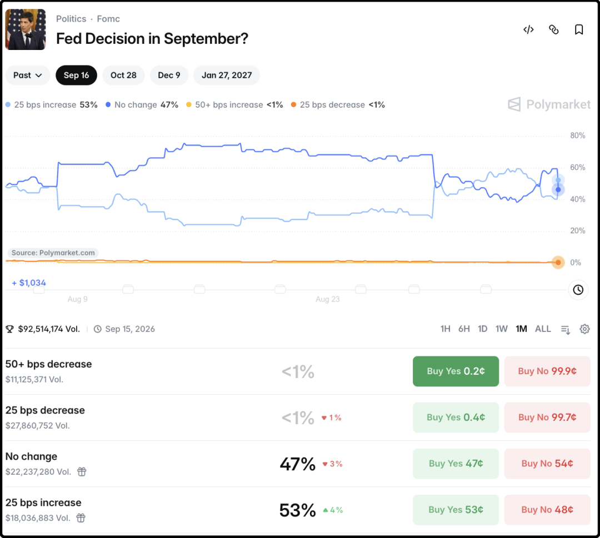
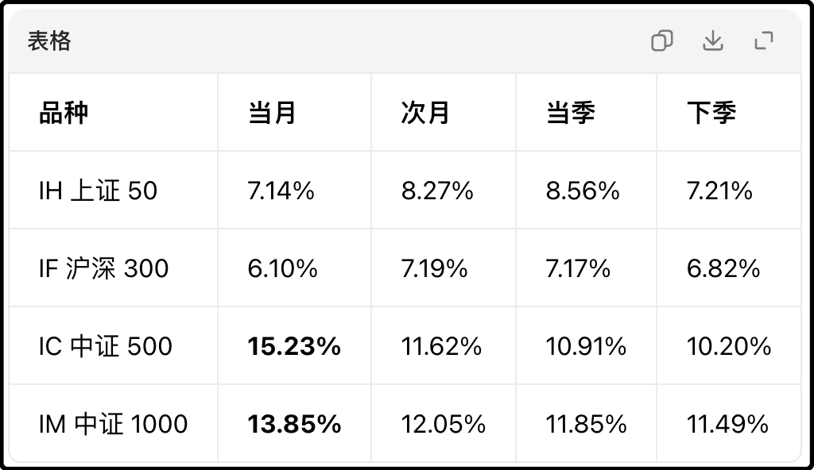
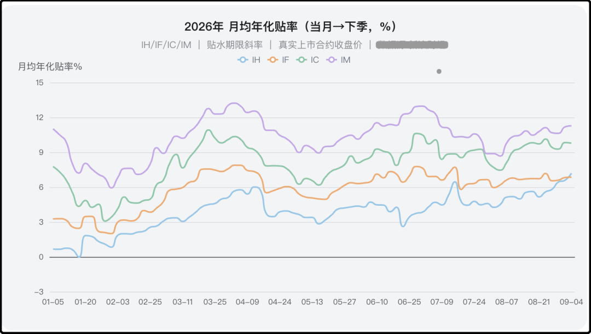

# 又来了，突发砸盘

今晚美国公布8月非农就业数据，增加16.2万人，这个数据远远高于市场预期的5.5万人，前值为减少2.3万人。简单说就是8月就业数据爆炸，显示美国经济有过热趋势，给9月份美联储加息狠狠推了一把。

数据公布后链上赌场关于9月份加息0.25%的概率从40%跳涨至53%，原本9月份利率不变的概率从60%下调至47%。

受此影响黄金瞬跌2%，区块链上的资产也都普跌2-3%，对今晚的美股估计也会形成明显的压制。

国内一直有个说法，美国就业频繁大幅改动，涉嫌造假。

其实这是统计规则导致的，美国的就业数据不是普查，是小样本抽查，然后再通过历史模型进行估算，初版数据本来就不准，后续反复修改调整是常态。经济上行的时候模型通常会低估，后期要上修，经济下行的时候模型通常会高估，后期要下修。

国内网友套用惯有思维，觉得就业数据繁荣是美国政府的KPI目标，所以有很强的造假动机。其实美国政府那边挺矛盾的，他们现在国债规模已经累积到40万亿，每年付息压力沉重，一直想着下调利率。

所以对特朗普来说就业数据好不好是两可的，就业数据好，他就对公众吹嘘自己治下美国欣欣向荣，然后暗示或者威胁美联储别瞎搞；就业数据不好，他就质疑数据统计出现偏差，后期会上修，然后转过头就催促美联储抓紧时机降息。

说真的现在当美国总统真挺割裂的，谁让家底都被掏空了，欠了一屁股债。聊到这顺便也讲讲40万亿美债是怎么滚起来的。

最早是布什时代打伊拉克那几年拼命借钱，给干到了10万亿；后来奥巴马时期为了应付金融危机，猛猛借钱刺激经济给干到了16万亿；特朗普上台后给企业大幅降税，政府没钱就借，给干到了22万亿；然后是新冠疫情，给老百姓发钱，给企业减税，干到了30万亿。30万亿之后倒是没再乱花钱，但是利率高，利滚利，再加上每年财政赤字借一点，就滚到了现在的40万亿。

你要这么看美国人民也不冤，基本上这钱大部分都花国内了，又是减税又是发钱的，每一任政府为了讨好选民都猛猛借钱，债越背越重，反正都留给下一任。

国内有不少人担心美债崩了赖中国的钱，其实咱们早就不是最大的债主了，中国这几年一直在减持美债换黄金，手里就剩6000亿左右，占比1.5%，且排后面了，天塌下来个高的顶着，不慌的。

……

我这几天一直在用aigc，不是纯聊天的那种，能给它布置任务干活的ai。一些链上的数据，特定池子的变化，我现在都让ai写程序帮我24小时扫描盯盘，大幅节约了我的精力。我现在才刚开始用，拿不准aigc的尺度，不敢给它太高的权限，后面会考虑单独买台电脑，开一个小额账户测试，这样可以让aigc监视到机会后自动执行交易，起码让它把自己的token钱和月费给挣回来。

我刚才随手给aigc布置了个任务，让我帮我计算4个股指期货合约的年化贴水率，这个太容易，半分钟就搞定：

你们会发现ic和im当月的贴率特别高，13-15%，但因为再过14天就要到期交割，这个贴率高意义也不大，我就让它换个思路，计算近月合约切换到远月合约的贴率，并给我画一条年内贴率波动的曲线。

说白了我想知道，现在近月换远月是否是一个好时机？

它按照（远月-近月）/月份数*12/指数的公式，计算了4个合约年内贴率的走势曲线，如下图。能很直观看到年初的贴率很差，最近的贴率相对较高，ic有9.78%，im最高11.28%，ai建议我现在换远月合约，是不错的时机。

我现在还会让它尝试每天帮我整理信息要闻，但只能是辅助，它经常会漏掉一些我觉得应该关注的内容。此外我还把我的历史文章打包了100多篇喂给它，让它尝试以我的风格写作。

结果怎么说呢，语气像，但内核不像，比如今天发生了20件事，我从中挑选我觉得有意思的5-6件事写，并进行我认为有必要的扩展。aigc无法模仿我这个选择的过程，它会把那20件事笼统的都写一遍。这个挑选内容，有详有略的过程我目前没想到怎么去教它。

之前有读者觉得我见多识广，问我平时都看什么书。事实上我实体书已经很多年不看了，除了少数人文艺术类作品，互联网是比实体书好1万倍的平台，尤其是现在还多了ai这个工具，从学习和摄入信息的角度效率比看书好十倍百倍。每天硬性让自己保持和ai的交流，是这个时代最好的学习方式。

今晚就这些。

作者: 猫笔刀

查看原文 →
