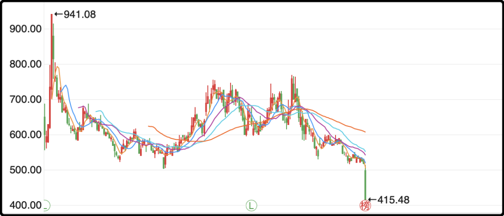
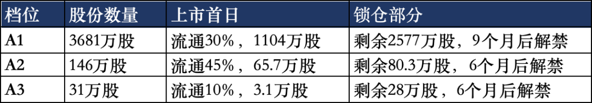

# 吃相极丑

昨晚后台留言关于要不要取消英语主科的话题有300多条评论，这是个老坑，我对这件事的看法也讲过两三次，和以前不同，我现在不再试图说服别人接受我的观点，放下劝人情节，尊重各自选择。

其实不单英语不用学，普通话也是可以不学的。我不是故意说反话，是因为想到了我的外婆，2014年去世，她去世的时候我30多岁了，但在我的记忆里她从没说过普通话，不是不想，是不会。她也不识字，除了自己名字外别的字都不会写。

所以就算你在中国不会讲普通话，不会写汉字，像我外婆一样长时间在县城生活，其实会讲方言也够了。但如果你想接触外面更大的世界，在更广阔的平台上和更多的人链接，那会说普通话、会写汉字就是你必须学习的技能。

英语也一样，如果你想要链接国际平台这是你必须掌握的，但90%的中国人够不到那个平台，所以他们觉得学英语没用是客观事实。现在为了那10%的人，强制要求剩下的90%都跟着学英语，确实有些浪费。

但麻烦的是那10%的人你没办法事先选出来，如果龙生龙、凤生凤就好办了，老鼠儿子从小学打洞，以后建议父母年收入不足10万的孩子不用学英语，男孩铁人三项，女孩吉祥三宝，安排了。

现在废学英语和新民族主义话题经常捆绑到一起，多说无益，你问我滋不滋瓷，我起码不反对，因为我们家不是受害者，怎样都行。

……

今天a股出现了恶丑的一幕，摩尔线程一开盘就被爆砸，很快就-20%跌停躺平。公司也没啥利空事件，之所以股价暴跌是因为上市刚满9个月，线下A1通道打新的机构持股解禁了，流通了，他们的成本是114元/股的ipo发行价，今天即便跌停卖出也有265%的盈利，所以用脚投票就砸了。

这里我给诸位解释一下，打新的时候我们散户申购的是线上发行的部分，比如摩尔线程是1680万股，占总股本的3.57%，比例不高的。

网下打新部分，就是给机构们分的，是3920万股，占总股本的8.3%。这3920万股分A1、A2、A3三个档位，具体有什么区别我做个表格。

今天就是a1档位2577万股解禁的日子，大约107亿市值，这里面哪怕只有2-3成的人想减持套现，也是二级市场的久财们接不动的。因为摩尔线程之前每天的成交额只有2-3亿，今天成交额爆增至34亿，翻了10倍，二级市场已经尽力了。

我之前就吐槽过打新制度里给网下的比例太多了，导致网上申购中签率极低，摩尔线程当初单账户申满也就0.36%的中签率。人为制造的稀缺让新股上市爆炒，股价一度涨了8倍，但最终陆续流通的限售股会让二级市场付出代价。

这不是摩尔一支股的问题，今天沐曦股份也跌了10%，因为它的情况和摩尔差不多，去年12月17日上市，再过10天就满9个月，到时候A1档会解禁1396万股，相当于目前流通盘的75%。今天股价预防性下跌，提前兑现了10天后砸盘的预期。

除了网下机构解禁，12个月、24个月、36个月，还有更多批次的原始股解禁，所以我一直不建议炒次新股。次新股的长线回报率很不好，深次新股指数（代码399678）2011年上线，15年累计下跌38%，真是粪坑中的粪坑。虽然也偶有牛股，但整体制度上设计就是坑接盘久财的。

……

今天a股成交1.95万亿，虽然量能还是不太够，但今天指数涨幅喜人，究其原因还是科技板块杀回来了，创业板+3.4%，科创板+2.4%，科技领涨带动中证500和中证1000也都上涨超过1%。

这里面有2个原因，1个是周五晚美股硬科技就大幅反弹，所以周末就有科技补涨的预期，今天海力士+8%，三星+5.6%，全球科技板块表现都很强劲。

另一个原因是高盛今天出了一篇针对光模块的研报，大幅上调了未来3年光模块的出货预期，2026-2028年分别上调了30%、80%、110%，这是很大幅度的上修，比较罕见。高盛做出这个预测变化不是因为未来的服务器需求增加，而是GPU\ASCI平均配套的光模块数量增加了，所以需求变大了。

我尝试去看光模块增加的原因，嘿嘿，看不懂，所以记住结论就行了，炒个股又不是要去当科学家。本来最近一段时间光模块走势不太妙的，营收不及预期，美国潜在封杀，韩国技术路线挤兑，多个利空一直打压股价，结果高盛这次强力助攻一把翻身，中际旭创大涨10%，新易盛跟涨8%，突然又好起来了。

科技只要一涨就会有资金虹吸效应，然后传统行业和小盘股就不行了，很明显的跷跷板，尤其a股现在几乎没有增量资金，每天的饭只够让一个人吃饱。

……

1、央行继续增持黄金，这次买了65万盎司，大概是20吨，和上个月几乎持平，但远远多于上半年的月均水平（5-8吨）。今天还看到了世界黄金协会对未来15年市场预测，他们认为接下来年化回报率会在5%左右，是他们有需求模型算的。

我搜了一下历史数据，黄金从1971年开始（布雷顿森林体系崩溃），至今天的投资收益率是4.8%，在世界主要投资品里算回报率还不错的，能显著跑赢黄金的也就美股指数。

2、据说中证协在摸底券商交易佣金的情况，正在讨论是否需要“免五”。散户对最低佣金5元很敏感，因为对于资金量不足10万的mini户来说，最低5元是一个负担。我因为买卖单的交易额比较大，一直对5元低消无感，但券商的朋友告诉我，散户人数多，交易频次高，别小看5元低消，累计起来也是很可观的贡献，经常能在总佣金里占好几成。

前几年有一些券商内卷升级，推出过万1免五的佣金，结果露头就被打了，谁现在公开宣传免五是违规的，因为相当于砸烂整个行业的狗盆，会被同行举报的。只要行业没有遭遇重大变革冲击的话，大部分券商是不愿意免五的。

3、小米今天出了18FOLD折叠屏手机，10999元起，最贵的14999元。华为的3折叠也不便宜，20000-25000。苹果三天后也要发布折叠屏手机，市场预测15000-20000，你要这么比小米其实也不算很贵。

今晚就这些，发射。

作者: 猫笔刀

查看原文 →
