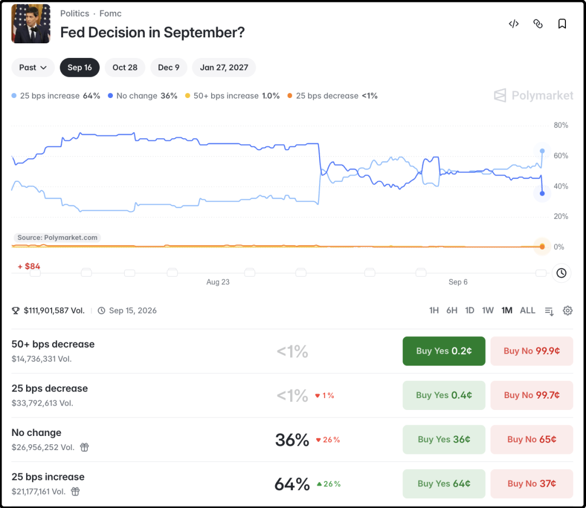
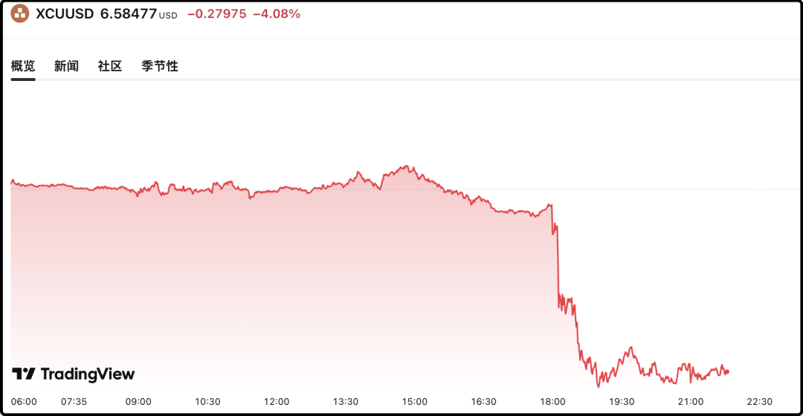

# 阴云

前些天有自称职校学生在网上说，自己曾被派到云南某鲜花饼实习，一天工作12小时，酬劳50元，因为不满待遇就朝饼里面吐痰。事情发酵后警方就锁定了当事人，今天发了澄清公告，已查明当事人曾在2014年于鲜花饼厂实习26天，为博取流量，凭空编造出这件事。

我看完通报后陷入了沉默，原来当事人真的曾经去实习过啊，现在警察找上门那就算真的吐过也肯定说自己没吐过，感觉是澄清了，又似乎是实锤了

这个新闻让我联想到了前几年有一家啤酒上市公司，员工在货槽里小便，一泡尿嘘掉了几十亿的市值。食品行业存在着大面积的廉价雇工，底层工作人员对薪酬不满意，就很难对自己的工作产生责任感，甚至偶有摩擦矛盾，还会在食品生产环节实施报复。

这类事情曝光出来这么多，没曝光出来的只会更多，不能细琢磨，想多了什么都不想吃了。

包括前几天赛事事故差点烧死车手，网上铺天盖地的指责都是冲着承办方去的，骂现场工作人员的少，因为网上曝光现场保安人员招兼职一天费用是60元，那天留言评论里点赞最高的是“60元你拼什么命？问薪无愧”。

互联网越来越关心廉价雇工的问题，这就像造房子的时候偷工减料会有安全隐患，老板为了省钱压成本招一些对工作不上心、缺乏责任感的雇工，真出事了承担代价的是客户。

……

今天a股成交1.65万亿，又又又缩量了，之前有几次缩量的底线是1.5万亿，这次还没突破底线，正在逼近底线。现在肯定没什么增量资金进场，存量资金也有一大批谨慎观望，场内流动性减少，之前活跃的概念板块逐渐冷却。

今天涨最好的板块是银行+1.47%，你就知道避险情绪有多重了，银行板块本来上半年被科技抽血快抽晕过去了，结果7月份以来强势反弹17%，年内创新高+7%，连涨3年（+37%、+10%、+7%）并大幅跑赢大盘。

跌幅榜那一边是前几天还很风光的厄尔尼诺概念，农业相关的今天重挫4%，之前涨的时候生怕明天就吃不饱饭了，今天一跌粮食危机解除了，股民们的理智重新占领高地了。

我觉得诸位美元加息的风险不可不防，今晚美国披露的ppi数据高于预期，再加上油价一路暴涨，布油已经冲到了105美元，原本五五开的局面已经逐渐向加息0.25%的选项倾斜，美联储9月17日（下周四）凌晨做决定，一旦加息落地，大宗商品市场都讨不了好，包括农产品。

嘿，我写文章这会欧洲央行加息0.25%了，那美联储跟进的概率又变大了。

总的来说我觉得目前的行情处于风险可控状态，指数处于平台震荡区间，地量只要不和持续不断的阴跌搭配就不算很糟，无非就是浪费时间罢了。股民的时间最不值钱了，大部分人没有机会成本的概念，很多人炒个5-10年，账面不亏钱就能知足。

……

1、国际铜价刚刚一波-4%的下跌，原因不单单是美元加息的预期，关键还有媒体报道美国正在重新考虑精炼铜加关税这件事，因为顾虑此举会推高铜价和国内生产成本。该消息是路透社报道，援引两名白宫人士。需要注意的是，不是取消关税，是 “重新考虑、陷入犹豫”，属于政策预期松动，如果真取消了可不止跌4%。

2、苹果昨晚推出了首款折叠屏手机duo，性能什么的我这里就不介绍了，还是挺厉害的，整体做工相比前几款安卓的折叠屏手机更精良，定价16000-25000，市场预期一年能出货500万台，和华为折叠屏的出货量相当，目前折叠屏手机出货量最大的是三星，市占率37%左右。

我之所以一直对折叠屏手机不是很感冒，根本原因是缺乏必需应用的场景，我日常通讯、娱乐，用常规竖屏就够了，网上有人说折叠屏适合商务人士工作，我从不在手机上工作，因为工作讲究效率，真要拼效率手机完全不能和笔记本相提并论。当然这可能和我几乎不需要因公出差有关。

产品发布后苹果股价昨晚小跌，今晚小涨，算不上很大利好，果链今天整体小跌也没啥表现，

3、我昨晚提到宇树科技明年解禁原始股的成本只有2-3块，贵的10元、31元，很多读者表示震惊，你要知道最早那批投资人是2019-2020年入股的，当时还没在春晚出名，产品也不成熟，处于早期摸索阶段，更别说盈利和上市，没影的事。能在那么早期敢投资，还投中了，赚100倍也不用眼红。成本31元是美团2024年入股的，当时总估值80亿。

宇树IPO一开始计划发行价是100元左右，后来因为被机构追捧抬到了150，宇树本身没毛病，人是按照400多亿的估值募资的，至于翻10倍给顶到1100完全是二级市场自愿接盘，与人无尤。

4、之前倍受关注的刘翔官宣以49.9万买断自主择业，同时把2015年退役至今领到工资和补助，一共98万多都捐给了西藏泥石流救灾。说实话这个金额比我想象的低，之前找ai算过说像他这么卓越的运动员买断得100万往上。

刘翔这事做得还挺漂亮，彻底堵上了“吃空饷”的嘴。其实但凡稍微有点脑子的人都说不出刘翔吃空饷的话，他职业生涯一共收入5亿多，其中有1/3是要和教练组、体制单位分的，国家培养他的钱早就10倍以上赚回来了，退役后挂职那三瓜两枣对他就是一根毛。好笑的是互联网上就是有那么多傻蛋，唧唧歪歪指责他吃空饷10年还不懂感恩。

今晚就这些吧，发射了。

作者: 猫笔刀

查看原文 →
