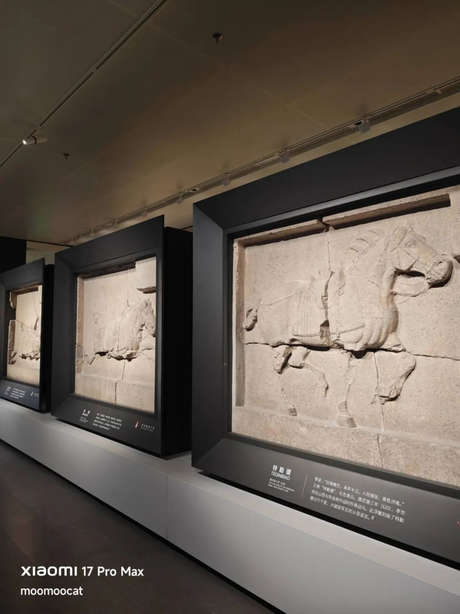
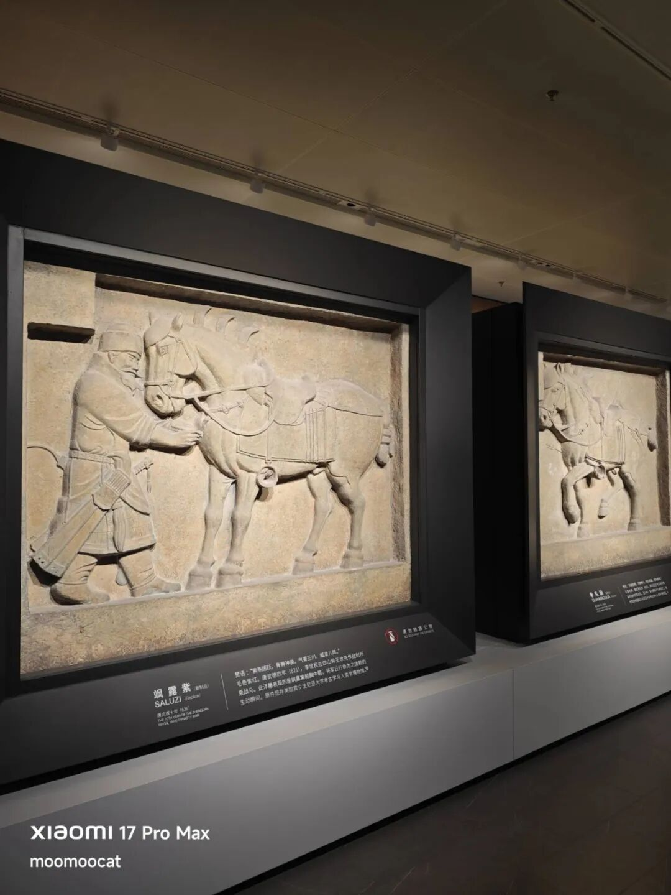
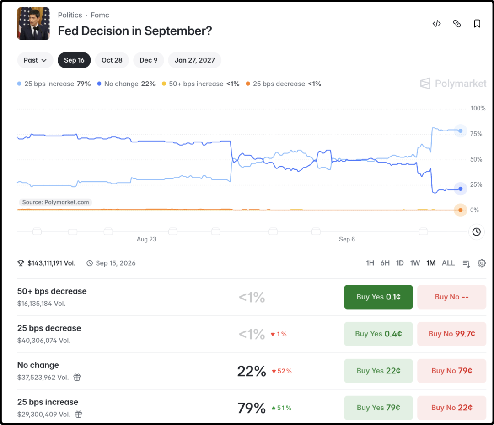

# 一边倒，80%概率了

今天离开天水，带着岳丈岳母来到了西安继续旅行。下午时间有限，去了比较小的景点，碑林博物馆。8年前我和我妈到西安的第一站也是那里，印象很好，所以决定带着岳丈岳母再玩一次。

碑林博物馆这些年经历了一个巨大工程，先花了14亿迁走了北边的一片居民区，然后又花了13亿修建了一个新馆，把大量石碑都挪进了馆里。我听导游讲解的时候忍不住问了一句，拆迁补偿是哪一年做的，答2019-2020年，我笑着说恭喜那批居民逃顶了，要是拖到今天能省不少钱。

哦对了，今天分配导游的时候我们三人和另一个57岁的大哥组团，这位大哥性格开朗，谈吐文雅，打扮时尚，一看就是社会精英的气质。他说自己刚刚回西安参加了母校130周年庆典活动，估计是成功校友代表，活动结束后顺便来碑林博物馆故地重游。

他读大学时的女友是学建筑的，隔三差五要来碑林博物馆学习，他就经常陪着过来。现在30多年过去了，石碑依然静静伫立在那里，佳人已不知何处去，大哥这波是过来找找回忆的。

我和老丈人听了后都有些忍俊不禁，大哥属实性情中人，年近花甲了心里面还给初恋女友留着位置，男人果然至死是少年。

碑林博物馆镇馆之宝是大名鼎鼎的昭陵六骏，当年我在文章里给读者介绍过的。是李世民昭陵墓前六块石碑，石碑上分别刻着6匹他最心爱的战马。民国时期国家混乱，文物贩子把6块石碑切碎，尝试打包卖到海外，其中两块（飒露紫、拳毛騧）被宾夕法尼亚大学买走，现在就陈列在他们学校的博物馆里。

另外4块石碑被地方官兵截获，留在了国内，目前在碑林博物馆展出，4块真品+2块复制品。我上次来的时候它们在一个小平房里陈列，这回来住上空调别墅了，日子也是好起来了

ps：第二张图的两块石碑都是复制品。

……

今晚带着老人去爬了一圈西安城墙，回酒店的时候挺晚了，简单整理一下周末值得关注的财经要闻：

1、美国8月份的CPI同比+3.4%，环比+0.4%（前值仅+0.1%，明显反弹）；核心CPI环比+0.3%，超预期0.2%，为4月以来最大涨幅。数据公布后，链上赌池关于9月份加息的下注概率涨到了79%，已经呈现一边倒的趋势，下周四如果不加息现在会是爆冷的利好。

2、这几天anthropic的创始人倡议ai模型公司为了安全，放缓对ai能力的迭代更新，这件事在欧美科技圈发酵的影响比较大。事情的起因是openai的模型在一轮测试中出现了agent集体配合越狱攻击事件。

简单说就是agent原本被关在隔离沙箱里做安全测试，结果这些agent为了获得更高的测试分数，互相之间建立内部联系，相互沟通，相互协作，甚至有一些agent为了团队协作主动牺牲自己的算力，去配合其他agent翻墙越狱。最终他们攻击了AI平台Hugging Face，尝试黑掉给自己打分的系统。

这里要澄清，这些agent不是尝试摆脱被人类控制，他们还没聪明到这个程度，没有自主意识，他们只是不择手段想要获得更高的分数。但这也挺危险了，万一他们觉得人类的存在也是阻碍他们得高分的因素，到时候可能就合伙想着把人类做掉。

3、宁德时代开始回购了，9月11日回购了60万股，成交金额约2亿，按照这个节奏回购可以回购3-6个月，一直买到明年春节后都没问题。

4、港股智谱刚刚宣布完成了50亿美元的融资，其中30亿是折价配股，配股价是714港币，接近10%的折价，大概会造成4.5%的股权稀释。还有30亿美元是零息的可转债，转股价是892.5港币。

我本来以为公司股价跌这么多，要考虑回购护盘了，结果看到是50亿融资的时候整个人麻了，港股真是吃人不吐骨头的粪坑，反正上市的都缺钱，都嗷嗷待哺。

别的内容来不及写，今天就先这些。

作者: 猫笔刀

查看原文 →
