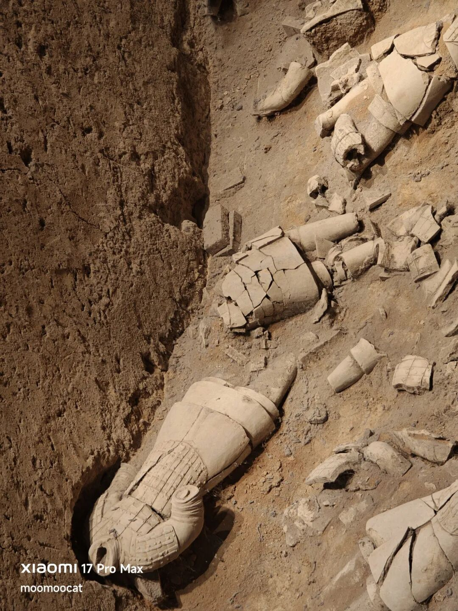
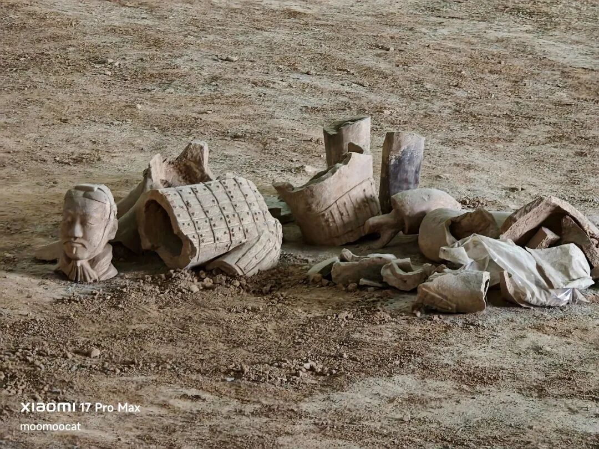
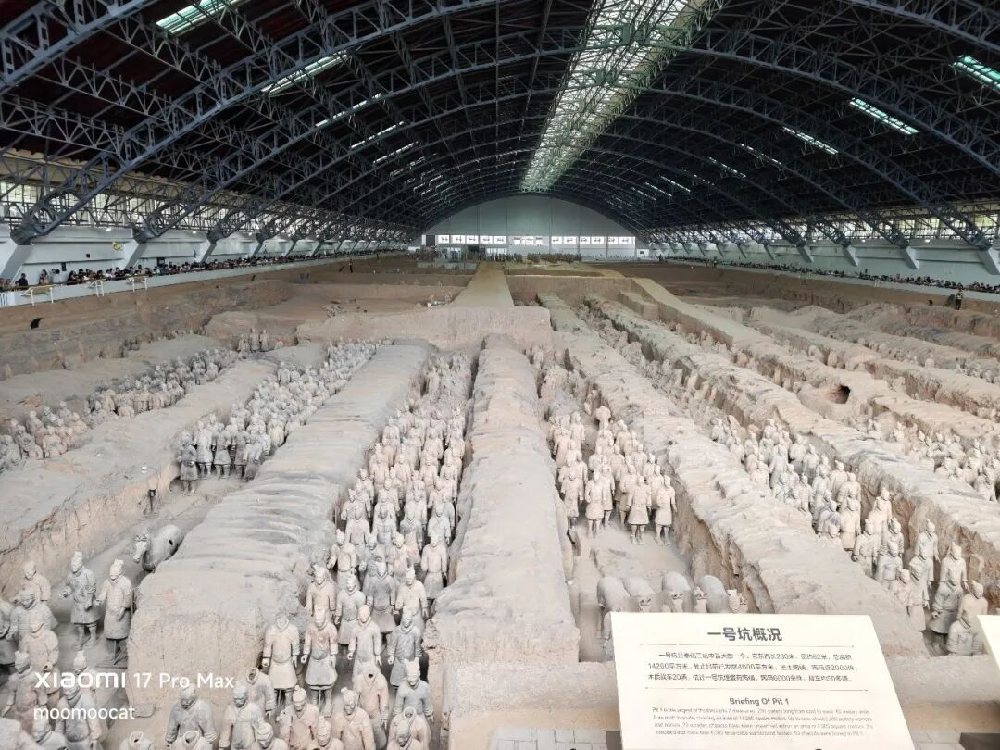
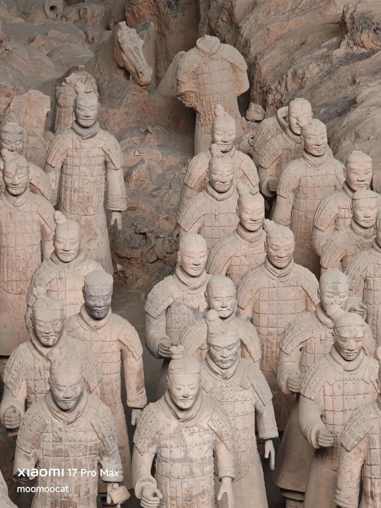
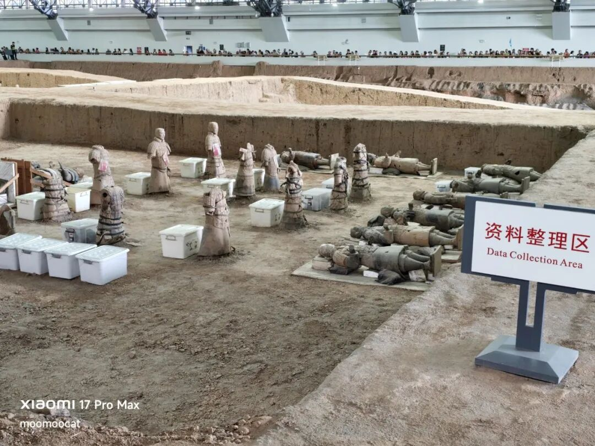
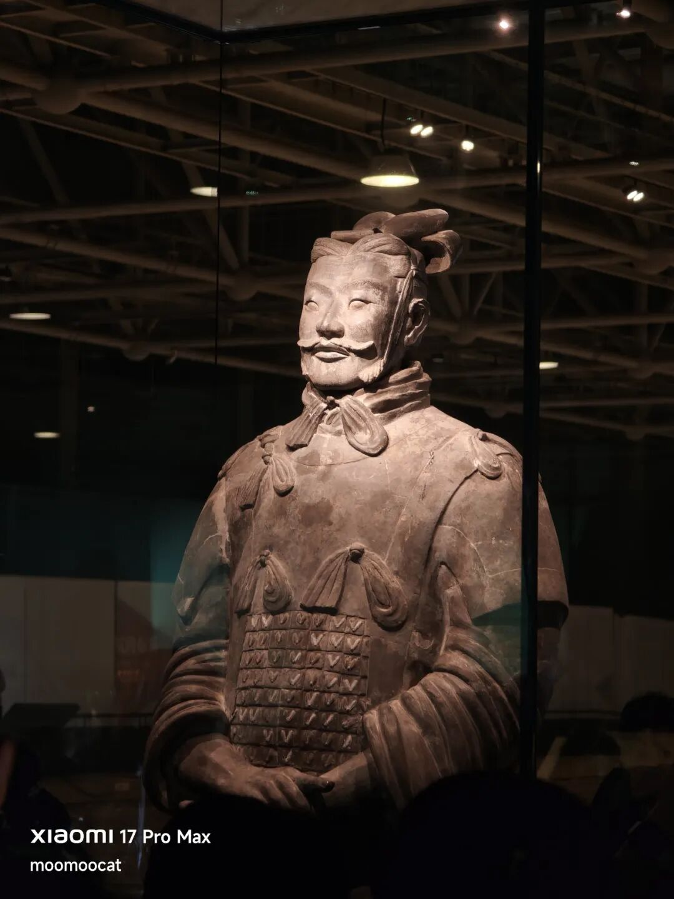
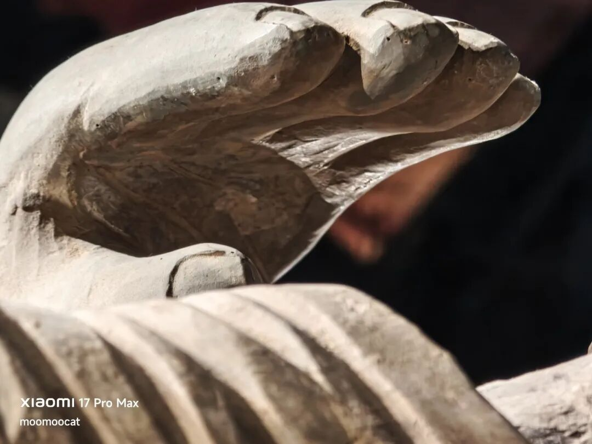

# 有两个想加

我通常旅游过的景点都会写游记，但八年前看完兵马俑后没写，原因是那一晚我和我妈看了《长恨歌》演出，等坐大巴回酒店的时候快10点了，没时间了。今天我带着岳父岳母走了同样的路线，也安排了他们看《长恨歌》，但这次我提前打车回酒店了。

兵马俑举世闻名，网上人人皆知的我就不写了，补充点我觉得有意思的细节。

兵马俑的身份是守卫秦始皇帝陵的阴兵部队，毕竟再疯狂的人也不敢拿8000人的皇城精锐军队殉葬，所以就一比一还原造了8000个兵马俑替代。孔圣有句名言“始作俑者，其无后乎”，我不能理解，历史上一直到清朝中期都还有活人殉葬的习俗，用泥俑替代已经是非常非常文明的进步了。

兵马俑是1974年被陕西一个老农锄地的时候发现的，上报中央，评估为中国本世纪最重大的考古发现。专家建议就地建保护大厅进行挖掘，一开始申报150万预算，最后实际投入650万，这在1975年约等于14000名工人的年收入，换算到现在大概相当于10亿。

70年代中国还很穷，绝大多数老百姓甚至都没出过省，更不可能跨省旅游。所以开发挖掘兵马俑的目的不是为了商业旅游，当时主要是把它当作民族崛起、文化自信的形象工程，当作一个古代奇观向外宾展示。结果1978年的时候法国巴黎市长希拉克看完后忍不住赞叹“世界第八奇迹”，被外媒广泛引用，后来就成了兵马俑的slogan。

在我去过的国内景区里，兵马俑是外国人含量最高的，没有之一，断层领先。

很多人在网上看到兵马俑照片，以为挖出来都是一个一个的，其实不是的。兵马俑是空心的，不抗压，几乎所有兵马俑挖出来的时候都是破碎的，后期工作人员慢慢给拼回去的。当然我觉得为了更好的呈现效果拼回去是应该的，不然给外宾看的观感就差很多了。

我放的最后一张照片是兵马俑手掌的特写。8000个兵马俑是根据8000个活人士兵一比一复刻的，每个士兵的掌纹都不一样，每个俑做出来也是不一样的。

古代文物这一块，兵马俑已经是夯到顶的存在，国内没有对手，属于人生优先打卡的清单之一。

……

今天a股成交1.63万亿，量能持续萎靡，已经逼近此前的底线1.5万亿。可能有人会好奇，真要跌破1.5万亿意味着什么，其实也没啥，不一定会发生什么可怕的事情，但可以肯定离之前的牛市是越走越远了。

有些资金是被消灭了，有些资金是被吓破胆了，有些资金是失望离开了，有些资金是谨慎观望，最后愿意留下来交易的就是大家看到的这些，比之之前的高峰已经腰斩。

现在全球资本市场都在重新调整预期，石油价格还在涨，今天已经飙到110美元，看起来美联储9月份加息已经很难避免，黄金价格今天跌破了4300。在这样的背景下a股反而表现出了一定的韧劲，今天低开高走，中位数还涨了0.28%，相当顽强了。

“浪费时间”的行情就是这样的，大部分时候让你失望，偶尔几天给点惊喜，让那些犹豫要走的人心存侥幸又多留下来几天，再看看。

我倒不是很担心大盘会在这个位置发生崩溃，空头现在也没能力发动大规模的袭击，昨天那个跳空缺口有七八成的概率能在1个月内回补。假如中证500真往下跌了，我有想过补1-2手远月合约的ic，因为现在年化贴水率真不低，6个月贴5.6%，年化贴11.2%，这在值博率上很划算了。

还有黄金，我又在4100和4150的位置sell put了，这个操作的意思是，假如黄金跌到4100-4150我不介意再买点。我不看空中远期的黄金，美联储这次加息是暂时的被逼无奈，明年就有很大概率要降息降回来。

……

1、今天公布的居民贷款数据，2026年8月-2029亿，是自2007年以来首次同期转负。我看了一下历史上8月份的数据，2016-2022那几年基本都在6000亿以上，当时真是太疯狂了，全社会都在贷款买房，现在是彻底冷静了，过于冷静了。国家降了首付、降了利率，有些城市还送出补贴，但吓破胆的老百姓不敢借了。

2、摩根大通调整预测，认为美联储9月份和12月份分别加息0.25%，汇丰最新的预测也一样，认为美联储年内会加息两次。

3、沙特的东西输油管道（East-West Pipeline）的利雅得段及麦地那地区段多处遭袭，这是几天前的事情，近期确认该石油管道短期内无法恢复，维修可能需要数个星期。这条石油管道原先日运输量400-500万桶，占全球份额4-5%，毫无疑问将进一步助推油价。

我觉得有可能这是沙特在给美国施压，此前沙特求助美国希望他们帮着打也门胡塞武装，被特朗普拒绝了，那沙特也很有动力在油价上让美国觉得难受和痛苦。

4、受周末巨额融资影响，智谱今天大跌9%，minimax也跌了6%，美国那边巨头讨论放缓开发，停止内卷，咱们这边还在猛猛融资加杠杆投入。

5、政府多个部门在推进治理中小企业回款难的问题。我一开始以为只是针对汽车行业，现在发现汽车行业只是样板，要推广到其他行业。此举目的不仅仅是保护中小企业现金流，本质上也是在去杠杆，降低内卷烈度。在中国做生意有个让人讨厌的潜规则，就是强势环节喜欢扣押合作方的现金流，越强势扣押的越狠，早就该改改了。

今晚就这些，发射了。

作者: 猫笔刀

查看原文 →
