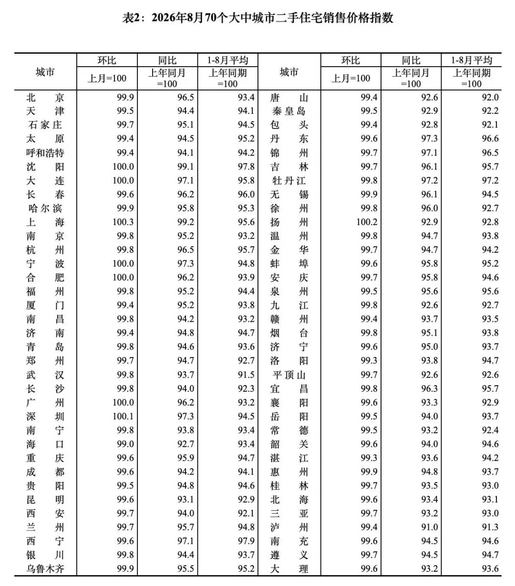
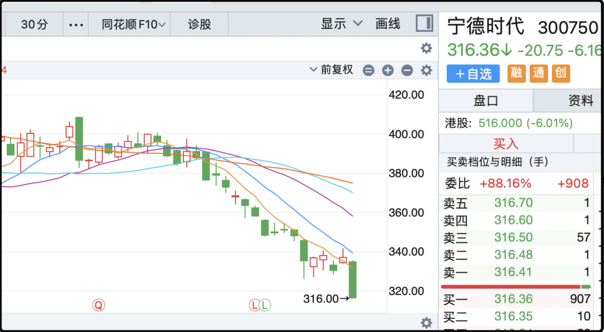
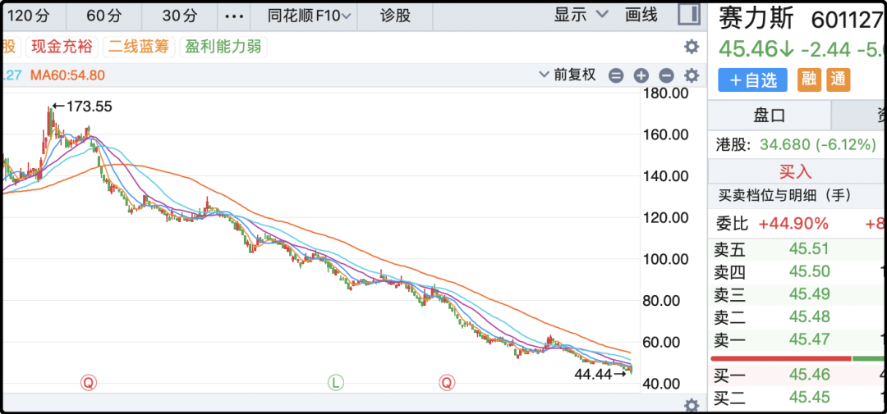
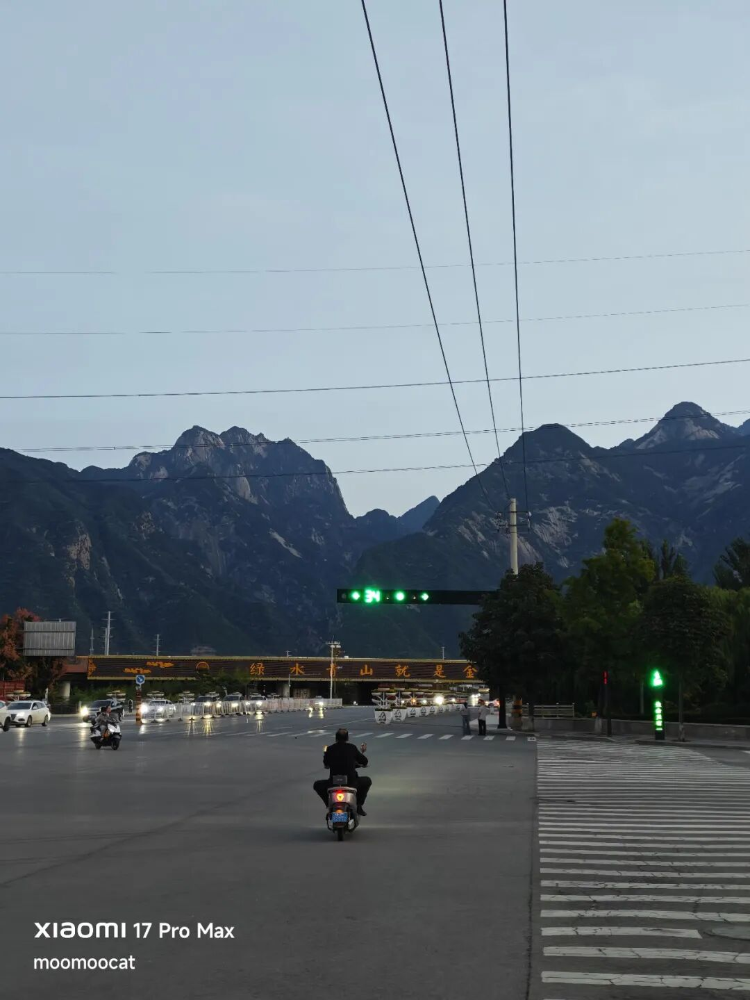
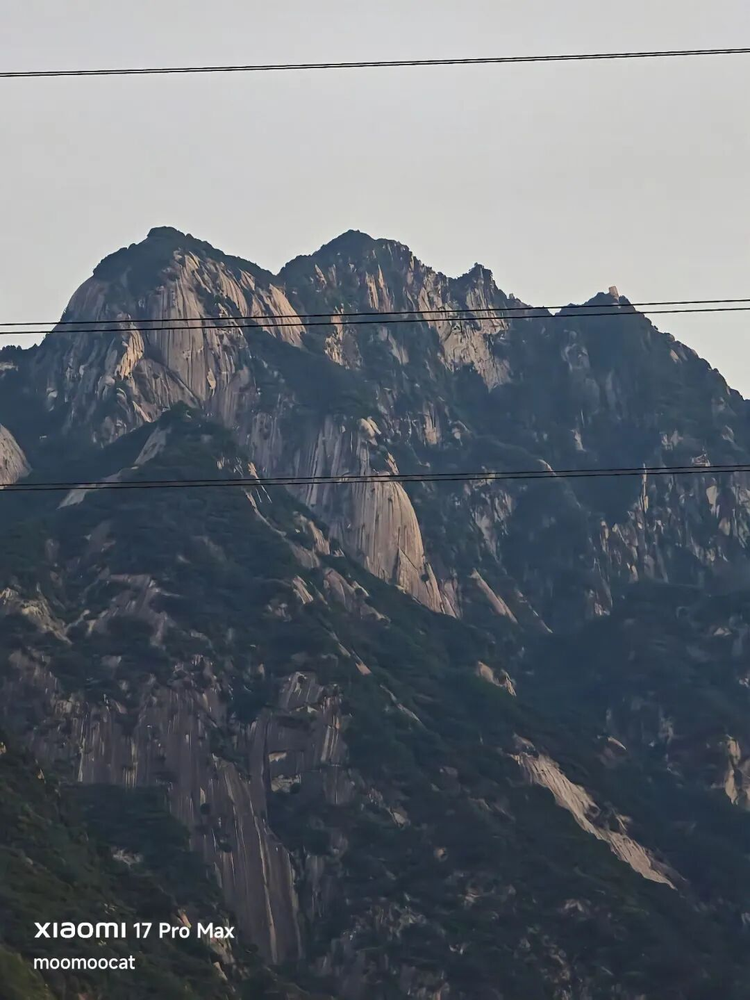

# 坏消息真多

今天统计局更新了8月份70个大中城市的房价，我长期跟踪数据，不多说先上表格。

8月份环比超过100的城市进一步缩小，只剩3个（上海、深圳、扬州），最近半年来上涨城市的数量持续减少：13 → 12 → 10 → 9 → 5 → 3。

过去半年一线城市整体上涨1.8%，是最强势的板块，这里面拉数据的是上海和深圳，拖后腿的是广州和北京。不过即便是最能打的上海，同比去年8月也跌了0.8%，这已经是70个城市里最好的表现，其余大多数城市同比跌幅都在4-7%区间。

所以没有任何迹象表明中国房价已经止跌企稳，官方为了安抚舆情，用的措辞是跌幅收窄，就是跌速变慢了，跌的没前几年快了，但不是不跌，更不是上涨。

虽然大城市的房子跌的慢，但租售比低，中小城市租售比高，但是跌的快，最后算下来两边是差不多的。有人问租售比超过房贷利率就一定不跌吗，这事也未必的，比如我前几天路过的天水市，当地租售比普遍在3%以上，房租可以覆盖房贷月供，但房价还是在持续阴跌。

因为年轻人持续流出，租房需求变少，租金在阴跌，只看静态租售比没用。

现在境外机构普遍认为之后国内楼市大概率是k型反弹，一线城市会率先企稳，三四线城市长期承压。小城市，尤其是人口持续流出的小城市，中远期都别抱什么希望。

……

今天a股成交1.61万亿，还在缩，我现在也很好奇能不能真给缩到1.5万亿往下。科技板块今天反弹了一下，把场内所剩不多的资金吸了一下，小盘股失血严重，微盘股指数-3.6%，全市场中位数下跌1.6%。

以前遇到这种情况双创能猛猛涨4-5%，但今天也只科创50涨了1.55%，绵软无力，创业板更是下跌了1.15%，因为权重最大的宁德时代今天罕见大跌6%，把整个板块都拖到阴沟里去了。

其实在今天之前宁德时代已经阴跌了一个月，倒不是业绩有什么问题，而是手底下的核心客户陆续“出轨”，理想汽车26亿入股了欣旺达，自己研发电池，小米改用欣旺达和中创新航的电池，问界、蔚来、小鹏也在搞电池备胎，大家都在不约而同的主动选择减少对宁德时代的依赖。

这也是汽车行业一直吐槽的事情，宁德时代太赚了，底下车企都在给它打工，现如今这些车企在有意扶持二线电池厂，削弱宁德时代的定价权。其实这件事是可以预期的，电动车行业残酷内卷已经一年了，下游车厂苦不堪言，肯定会向上游电池传递压力，再往上锂矿的好日子也到头了。

插个题外话，过去4个月碳酸锂价格下跌40%，我记得5月份有家机构看多碳酸锂价格，是谁忘记了，好像是zx？

宁德时代最近正好启动200-400亿回购，对长线股东来说下跌不是坏事，可以用同样的钱，回购注销更多的股票。不过短线宁德时代的股价趋势确实不好，长阴破位向下创年内新低，想补仓的冷静冷静，这种k线不用着急的。

……

1、今天赛力斯也是曝出重磅消息，他们和华为的合作关系重大调整。之前产品、营销、销售、服务都是华为主导，之后改为赛力斯主导，华为赋能。体面点的说法，是问界品牌成熟了，华为松手让赛力斯更具独立性发展。但市场这一侧的解读是赛力斯被断奶了，过去问界的成功高度依赖华为的品牌背书、渠道流量和营销打法，以后都要靠赛力斯自己了，行不行还不知道。

赛力斯目前正处于极其困难时期，二季度血亏22亿，这个节骨眼上突然背后大哥撤了，二级市场弥漫着悲观情绪，今天用脚投票砸了5%，过去12个月最大回撤74%，k线看着挺吓人。

2、美国10年期国债收益率升破5%，为2007年以来最高水平。主要是最近抛售美国长债的空头太多了，大家都在提前下注美联储加息。想想也是蛮割裂的，国内利息一降再降，国债利率和定存都已经跌破2%了，另一边美债5%大家还在卖。高血压这位，构建关税壁垒控制进口，低血糖这位，外汇管制防止资本外流，真是各自演各自的剧本。

3、8月社会消费品零售总额39824亿，同比增长0.4%，低于市场一致预期（预期 0.7%~0.8%）。关键是汽车这一块数据太差了，-18%，把大盘给压下来，如果把汽车剔除的话+2.5%。我们前几年为了刺激汽车消费进行了大量补贴，现在需求已经被挤的差不多，补贴又退坡了，国内汽车销量跌的很难看。

4、链上赌场关于美联储本周四加息的概率已经升至88%，这意味着你现在买不加息，要是周四真的不加息，你能从0.12涨到1，赚8.33倍。但要是压错本金就没了。这种概率差距通常意味着本周加息已经没太大悬念，接下来市场分歧博弈的是12月份会不会年内第二次加息。

5、美国承认自己拥有在轨太空武器，这是美国高层有史以来第一次正式承认已经有实战部署、在轨运行的太空控制武器，不是试验品，是现役装备。太空武器可以打击和捕获敌国的太空设备，感觉主要目的就是吓唬中国来的。我对细节不是很感兴趣，之所以写是觉得有可能短线刺激军工航天板块。

今晚就这些吧，今天没更新游记是因为没旅游，从西安转到了华阴，在酒店休息一天，养精蓄锐明天爬华山去。还记得我25年前在华山拍过一张照片吗，这波故地重游，希望我还能找到当年拍照的位置。

作者: 猫笔刀

查看原文 →
