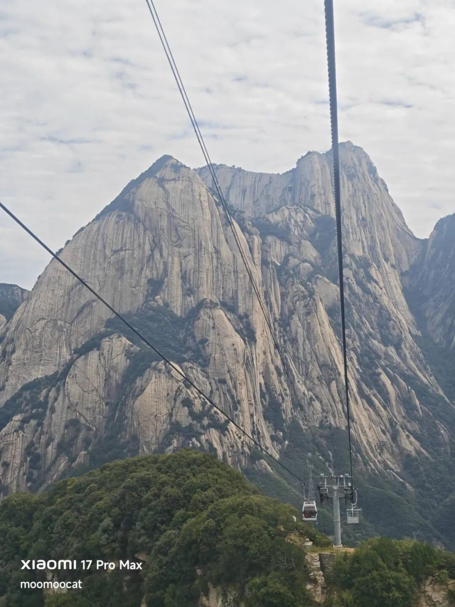
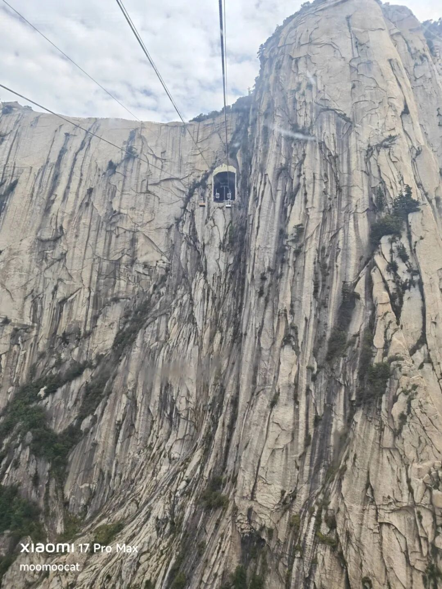
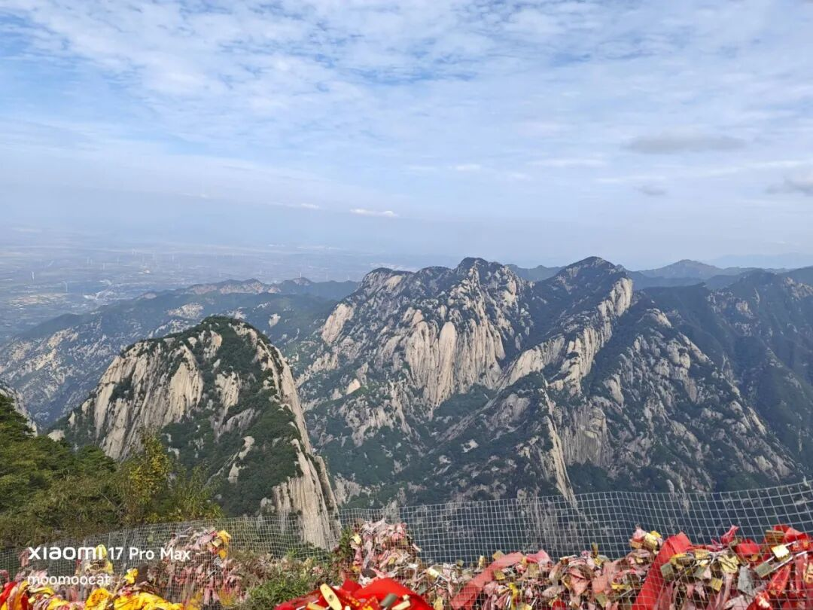
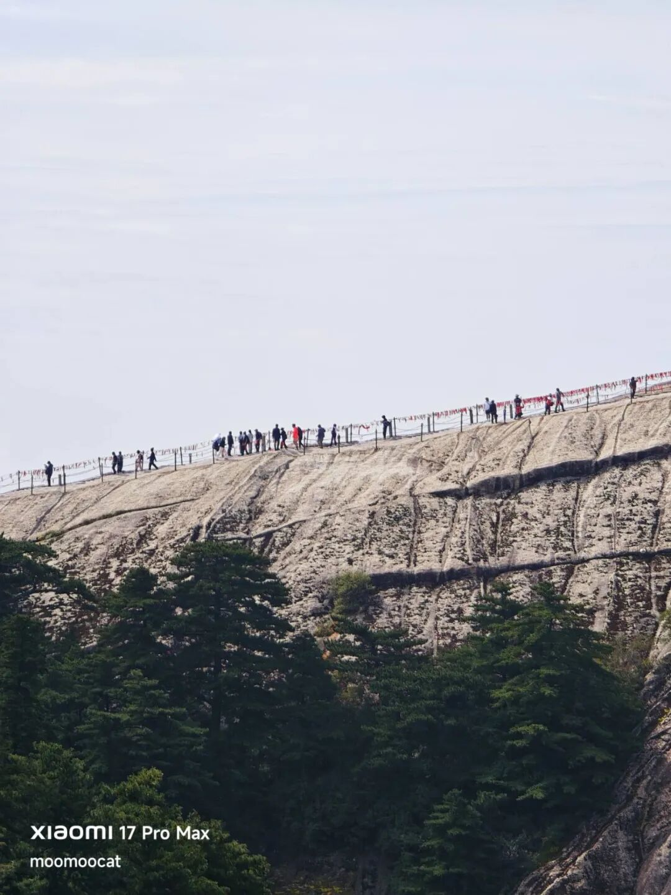
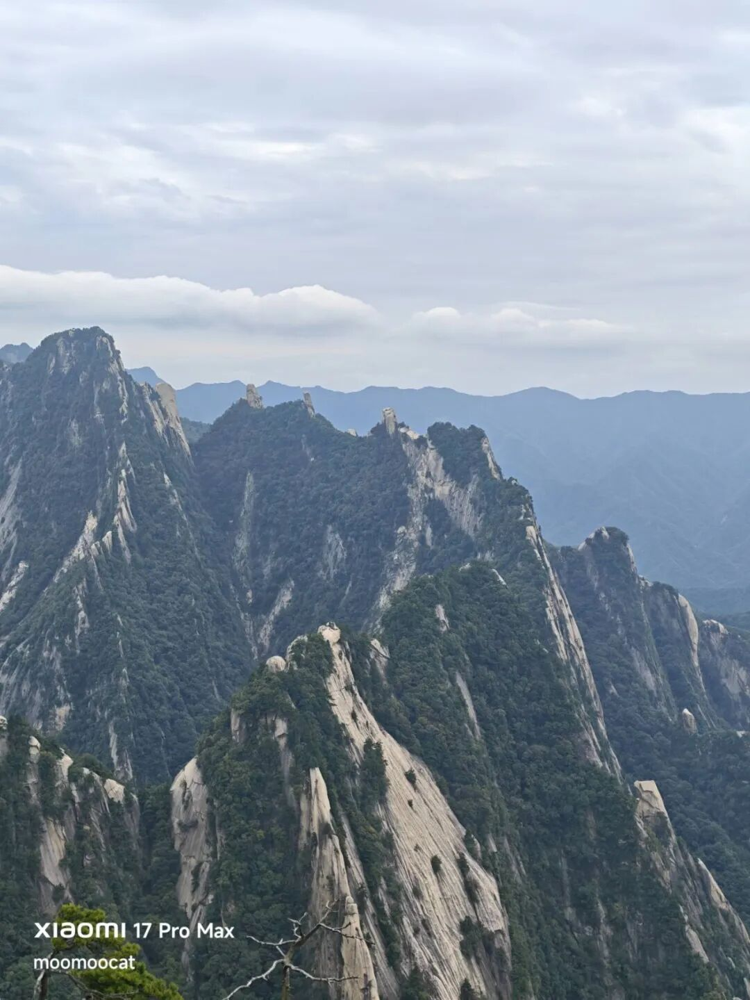

# 赚的多就招人恨

刚看了一眼微信运动，我今天走了19564步，狗腿走断了，这肯定是我2026年单日最大运动量。华山太大了，哪怕上下都坐索道，但上面几个峰绕来绕去的巨远，这19564步不是平地散步，是上上下下的台阶，强度拉满。

下午上厕所的时候，发现自己的嘘嘘小幅来回晃，低头看才发现是自己的两条腿在哆嗦。

我采纳了昨晚读者们的建议，走的是西上北下经典路线，沿途爬了西峰、南峰、中峰，无奈放弃了东峰、北峰。我一直有尝试找25年前拍照的位置，问过ai说大概率在北峰上，但走到北峰门口的时候岳父的膝盖已经很不舒服，只好作罢下山。

一路上我给岳父岳母拍了很多照片，他两虽然很累但看的出来很高兴，说起来也蛮感慨的，他两辛苦奋斗抚养一对儿女长大成家，因为操持的生意不方便中断经营，结婚这么多年从未有过夫妻两人为主的旅行，和我这次是第一次。

今晚吃饭的时候我就和他两说了，人生没有那么多放不下的事，有些时候你觉得非你不可，其实少了你照样转。希望那些退休后还在为子女奔波劳累的老人，能利用所剩不多的时间窗口，替自己走一走玩一玩。我近期会再搞活动抽一批读者，陪爸爸妈妈去旅行。

至于华山没啥可说的，确实壮观，尤其是坐西线索道，从山坳里翻出来那一瞬间豁然开朗，映入眼帘是气势磅礴的花岗巨岩群，我当时直接看愣住了，那种震撼很难用文字形容，手机也拍不出来，有一种巨物恐惧的感觉。

西线索道2013年开通，最牛的是在山壁上凿了一个150米的深洞作为站点下车，我第一次看到这么设计的。

今天天气超赞，不晒，凉快。

华山有大量山路都是行走在巨岩的岩脊上。

真的很好看的山，有人说颜值仅次于黄山，接下来我打算去黄山一趟，看看那里怎么个事。

……

今天在山上掏手机出来看行情，难得红彤彤一片，两市成交1.84万亿，比昨天反弹了2000亿。ai科技领涨，其它行业辅助，8大宽基齐发力，市场中位数+0.98%，算是难得皆大欢喜的剧本。

半导体发力，科创50大涨4.14%，成为表现最好的宽基。原本同频发力的创业板指今天“只”涨了1.96%，是因为权重最大的宁德时代又跌了3.44%，继续刷新年内新低。

宁德时代的股东过去几年日子过的太安逸，没受过这种程度的挫折，目前相关社区的情绪有些焦躁，已经有各种版本的鬼故事开始流传。其中最主流的说法还是我昨天提到的车企出轨，执行“去宁化”方案。

宁德时代挣太多了吗？单看数据是这样的，宁德时代上半年盈利432亿，而国内15家主流上市车企净利润加在一起只有210亿，看起来很像是整个下游在给宁德时代打工。但宁德时代的利润率建立在产品护城河上，车企们彼此产品高度同质化，很容易陷入价格内卷，这是双方核心本质区别。

假如，我是说假如宁德时代主动让利，所有产品降价10%，我觉得那些车企也挣不到这10%，它们会继续降价，尝试从友商那里抢走客户。这不是搞笑说段子，我是认真的，光伏已经演过类似剧本。

指数今天普涨把上周五的跳空缺口给补了，这是意料中的，这种低量能、震荡区间的缺口基本没有支撑性，很容易在随机波动中被抹上。今天虽然涨不少，但大盘依然没有选择方向，依然处于浪费时间的区间波动，感觉大资金并不很想提快节奏，可能十一之前也就这样了。

……

1、今天三一重工突然暴跌，没有直接利空，但近期坏消息不少。比如美国9月上旬对华液压缸发起双反调查，冲击三一重工出海业务；比如人民币持续升值，外贸汇兑持续损失；比如基本面面临下修，预期下调。

但这些都不是今天才有的，不是暴跌的直接原因，有人说又回到了之前一天杀一匹白马股的节奏，不知道明天倒霉蛋是谁。

2、今晚看到新闻说宁德时代打算近日对相关车企选择其它供应商传闻进行回应。啊？？这咋回应？祝他们幸福，还是不能接受+正式宣战。就算车企选择竞品友商这也是正常市场行为，我觉得宁德时代最好的回应是上调回购的力度，只要股价稳住了，自然会有股民站出来替你辩护。

3、今天有媒体报道说张一鸣已经成为新任亚洲首富，总身价1050亿美元，超过了印度的阿达尼。咱就是说自己跳动在产品线上确实厉害，做什么什么火，在吸纳互联网用户时间这件事上已经反超腾讯了。不过我对这个亚洲新首富有异议，明年deepseek上市，估值起码奔着1万亿以上看，乐观的话1.5-2万亿。持股8成以上的梁文峰账面上大概率超越张一鸣，等着瞧吧。

4、今天上的新股N信诺维低开低走，涨幅只有45%，单签收益6000左右，能明显感觉到炒新的热情在降温。次新股其实也有很强的周期性，以宇树科技为代表，在连续遭遇几次重创后炒新族现在低调多了。

今晚就这些，我挺累的，早点上完钟去睡觉。

作者: 猫笔刀

查看原文 →
