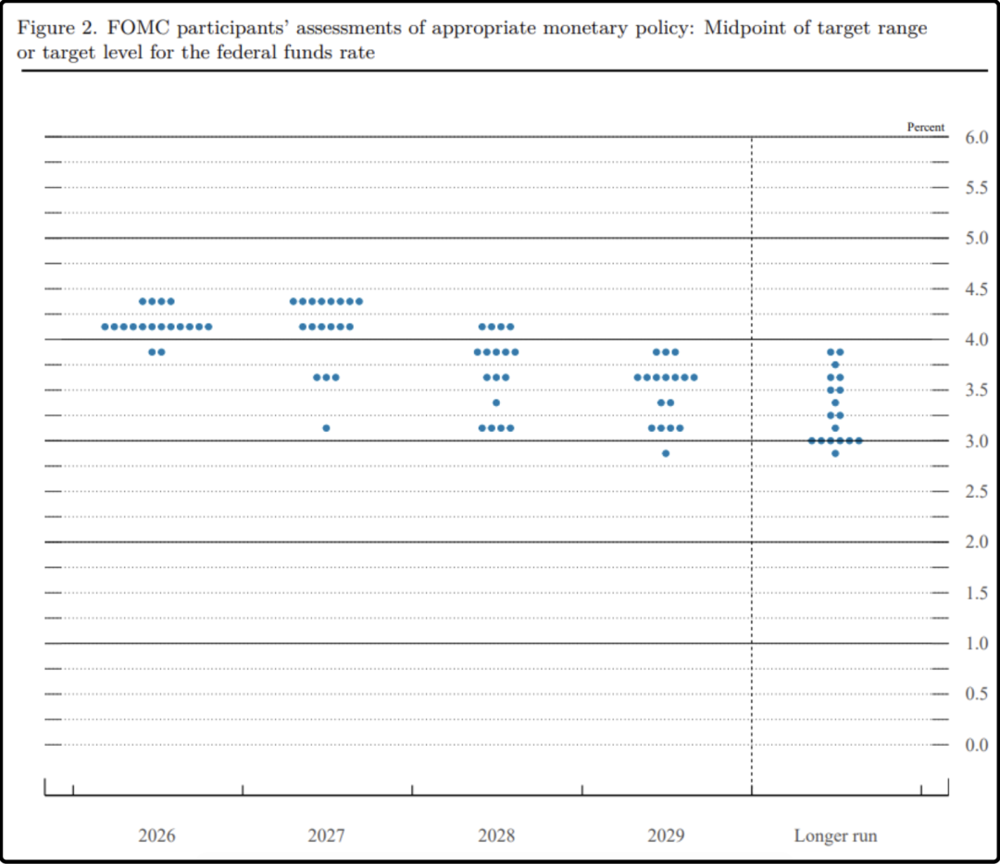
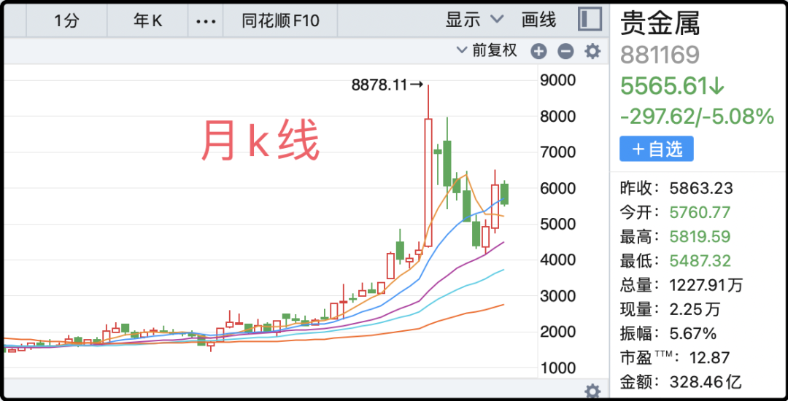

# 忍着，年内还有一次

旅行结束，岳父岳母回苏州，我回北京了。

昨晚美联储果然还是加息了，利率区间来到了3.75-4%。这个结果并不意外，因为资本市场前戏已经做足，预期都消化的差不多了。大家其实更关注的还是美联储之后的表态，接下来的操作才是市场博弈的焦点。

从最新放出的利率点阵图来看，18名委员里有12人投票认为2026年底的利率区间是4-4.25%区间，这意味着年底之前大概率还会有一次0.25%的加息，有可能是10月，也有可能是12月，具体要看通胀数据。

至于2027年，有一半的委员认为利率会到4.5%（再加0.25%），一半的委员认为维持不变或者降息。至于更远的2028、2029，大部分委员认为利率会持续下降，并最终在3-3.5%区间找到平衡。

所以这次加息周期并不会持续很久，它是跟随通胀反弹的一次加息反弹，不是周期反转，拉长时间看目前依然在美元降息大周期内，所以大宗商品也好，区块链资产也好，美股也好，并没有因为这次加息而大幅回调。只要对更远期的未来保持信心，市场可以接受眼前3-6个月的起伏与挫折。

……

今天a股成交1.82万亿，比昨天少，比前天高，1.5-2万亿这个区间就是在混日子，别指望搞出什么名堂。今天科技板块小幅回调，资金又从权重股回流了一些到小盘股，但规模不算很大。整体上市场风格均衡，市场中位数正好是0，没涨也没跌，非常完美的又浪费了一天时间。

我之前给你们分析过，为什么a股在主流市场里回报率最差，因为a股有一个其它国家股市不具备的技能，或者说特点，就是浪费时间。经常几个月几个月的时间，不涨也不跌，上两天班放三天假，就跟你混。我很多年前就看透了这一点，所以才会坚持投资有【时间补偿】的标的，这样才能长线跟它耗下去。

今天a股跌最惨的是黄金板块，直接来了个-5%，其实国际金价过去24小时不但没有跌，还少少涨了0.3%，也不知道a股这些砸盘的激动个什么劲。a股黄金板块一月份太疯了，涨了85%，之后一直在震荡回落，但即便如此年内涨幅依然有30%，大幅跑赢金价，从性价比上来说我觉得是不好的。

今天表现最好的是农林渔牧，实在没别的概念炒，又搬出厄尔尼诺那套叙事出来唬人。不管你们信不信，反正我不信，就a股农业板块那些个歪瓜裂枣，厄尔尼诺冲击再大它们也发不了财。从财务角度它们有好些个早就该从a股滚蛋了，就是因为舍不得广大久财才死赖着不走。

我出去旅行了一周，中证500指数原地踏步，我没操作也几乎很少看行情，最后啥也没耽误。你们如果打算长长久久在这个市场待下去，首先要调整的就是对待a股的方式。

……

1、我昨晚说deepseek明年上市起码1万亿市值，有读者表示怀疑，这些人估计平时没咋看新闻，deepseek今年6月刚融过一轮，估值是4000亿人民币，梁文锋自己投了200亿。本来后面还要融一轮，估值5000亿，风投机构挤破脑袋往里钻，但因为有人泄漏了梁文锋的内部演讲，deepseek掀桌子走人了。当时全网追着删相关文章，事后我琢磨可能那个演讲内容里有敏感信息。

总之deepseek如果按5000亿融资，有的是人抢着入股，一级市场都这数了，明年上a股你们觉得该多少。说1万亿绝对保守了，1.5-2万亿都有些不够尊重全世界最热情的久财。梁文锋持股比例80%+，你们算下他到时候得是什么数。

2、沙特请求阿曼出面斡旋，与胡塞武装达成2周的停火。国际油价短时间内跌了2%，黄金价格反弹超过1.5%。我了解了一下也门那边的战局，政府军是沙特扶持的代理人，但是战斗力拉垮，地面作战都是一触即溃，纯废物，根本不够胡塞武装打。沙特这边不愿意派出地面部队，怕死人也怕陷进去，他们只愿意派飞机在胡塞武装头上扔炸弹，毕竟泥腿子没有空军也没有防空。

但空袭无法获得战略胜利，胡塞武装接连攻下红海海岸的城市据点，目前占据优势。胡塞武装的目的很明显，学伊朗一样打劫红海航道，未来不排除收过路费的选项。阿拉伯半岛绝了，左边胡塞武装，右边伊朗，酋长们的蛋蛋被拿捏了。

3、商务部：中美经贸团队正就降税等议题保持密切交流。这是一个潜在利好，接下来中方要回访美国，既然是互访通常都会做出一点成绩出来才好交代，所以有可能中美会互降关税。

4、宁德时代计划14亿元在雅安新建4万吨碳酸锂年产能。需要注意的是目前仅仅是雅安那边的环评公示，尚未拿到环评批复、没有正式开工。最近碳酸锂价格一直在跌，4个月时间跌了40%，这次宁德时代投产的4万吨产能要2年后才能释放，所以并不会冲击短线价格，但会在长线上压制市场预期，锂价想要反弹上涨就不容易了。

今晚就这些吧，发射了。

作者: 猫笔刀

查看原文 →
