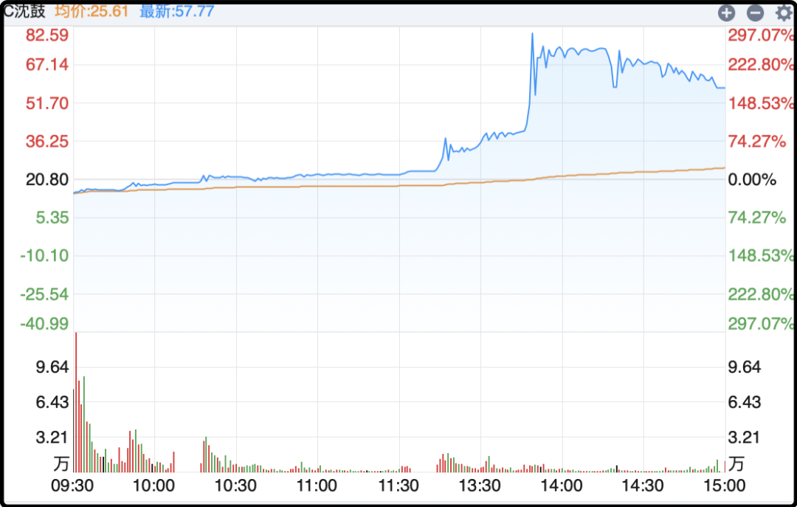

# 输不起的游戏

今天是九一八，巧的是亚运会男篮半决赛正好是中日这对冤家。这次日本队来的是二队，最厉害的4个主力（八村塁、渡边雄太、河村勇辉、归化中锋霍金森）全部缺席。中国队这边少了赵继伟和杨翰森，其余都是主力阵容。

结果一上来就被打穿了，第三节最多的时候落后35分，比赛很早就进入垃圾时间，最后相差19分被淘汰。

可能有人姚明、易建联之后就不怎么看球了，现在中国男篮早已不是亚洲霸主，澳大利亚第1档，日本1.5档，中国和伊朗、韩国、菲律宾、黎巴嫩在第2档里有输有赢。处境比男足好点但好的有限。

有一个现象很奇怪，计划体育的年代中国足球勉强算亚洲一流（3-8名），篮球亚洲霸主，结果搞了职业体育联赛后，球员收入涨上去了，竞技水平却在持续倒退，足球和篮球成绩都更差了。

我把这个问题抛给ai，得到的答复是我们旧有的专业队体制崩塌，新建立的职业联赛是极其不专业的“伪职业”，再加上亚洲对手持续进步，于是就掉队了。

曾经中国男篮是世界大赛8强常客，以后可能连冲出亚洲都费劲，已经连续缺席东京、巴黎两届奥运会，下届洛杉矶眼瞅着也很难。

……

今天a股出现了很离谱的一幕，昨天上市的C沈鼓，在第二天拉出了惊人的涨幅，盘中最高到+297%，最终收盘也有+177%。

在全面实行注册制后，新股上市前5个交易日不设涨跌幅限制，只在盘中波动超过30%、60%的时候分别停牌10分钟，所以C沈鼓才能涨到令人瞠目结舌的高度。

这股发行价只有4.39，昨天首日+373%，收盘20.8元。今天继续疯狂，涨到了57.77。

因为它的股价表现过于离谱，交易所执行自律措施把相关交易者的账户暂停了，肯定是对股价拉升影响巨大的重点账户。有人问这些大户下周一能卖吗？不清楚，最常见的情况是限制买入，但允许持仓卖出，只有很严重的处分才会同时限制买入和卖出，我认为这次大概率是前者，即下周一能卖不能买。

沈鼓这公司是东北国企，核心产品是大型离心压缩机，给核电站当主泵的。我查了下最近三年业绩不错，稳中有升：

2023：营收 82.06 亿，净利 3.55 亿

2024：营收 93.09 亿，净利 4.42 亿

2025：营收 101.22 亿，净利 7.39 亿

IPO发行价市盈率30倍，现在已经快250倍了。很明显像这种传统行业就算掌握核心技术，也不可能在中短期出现业绩爆发，所以今天的股价炒作完全脱离基本面，只是筹码层面的极端博弈。

股价波动不产生财富，它只会交换财富，波动的越剧烈，交换的越彻底。我对这种标的没什么兴趣，它能一天涨3倍，自然也能一天腰斩。人只玩自己输得起的游戏，我输不起所以我不玩。

……

今天刷到一个新闻，山东某退休副省长家里的管家偷卖藏酒，获利243万，被判刑10年。

管家叫李鹏，有厨技特长，会开车，被雇佣后获得雇主信任，参与家里一些琐碎事项，月薪5000。他发现雇主家里有大量整箱的茅台酒，就动了贪念，从外面买来假茅台酒，进行调包替换，再把真酒卖出获利。前后作案15次，卖得赃款243万。

很多人一看标题就会联想到退休副省长家中巨额财富，涉嫌贪腐。这个案子里的陈延明2006年就退居二线，2008年正式退休，距今快20年了。

他的女儿是私募基金管理人，自述家里的酒都是自己这些年陆陆续续买的，主要用途是接待、收藏、投资增值。

陈璐在法庭上出示了两份书面证明，第一份是北京的便利店在2006–2014 年，卖给陈璐78箱茅台。另一份是济南美诺酒店下属烟酒门店，2012–2018年合计卖给陈璐66.5箱飞天茅台。这解释了家中巨量茅台酒的来历，由于买入时间基本都在其父亲退休之后，所以法庭上没有进一步追究。

我当时看到这里的时候心里咯噔了一下，之前很多人都在估算茅台酒有很多买回去都没喝，放到家里当投资品收藏，这下看到真实案例了。社会上像陈璐这样的茅台大买家一定还有很多，他们家里囤放了数百万甚至上千万的茅台酒，我总觉得这在未来是个隐患。

酒喝不炒，囤酒的未来要是遇到个啥事，集体恐慌变现，二级市场接的住嘛。除开金融属性的茅台酒到底值什么价，现在也不好说。

……

今晚就这些，发射了。

作者: 猫笔刀

查看原文 →
