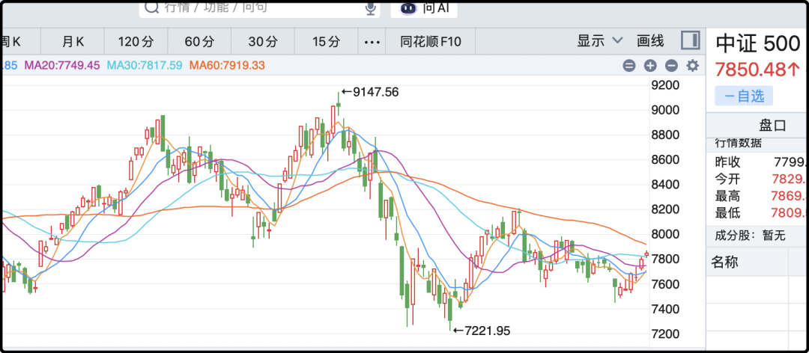
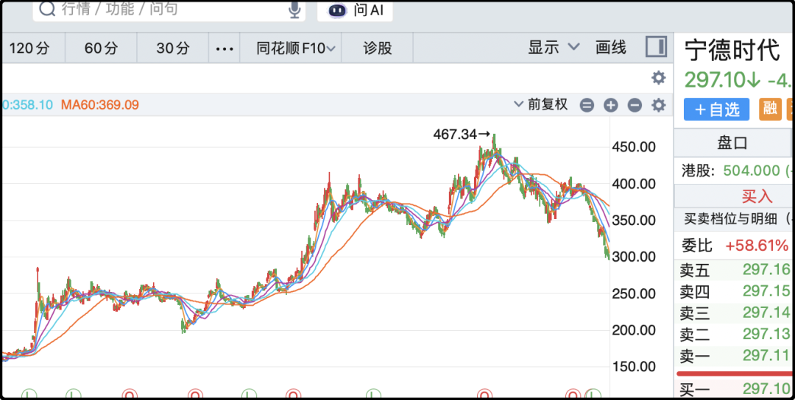

# 这么穷也敢结婚

我今天在短视频刷到一部冯巩以前的老电影，片名叫《没事偷着乐》，这片拍摄于1999年，后来还改编了一部电视剧叫《贫嘴张大民的幸福生活》，在千禧年那会挺有名的。

这剧的大背景是父亲早亡，母亲带着兄弟姐妹5个挤在一套40平米的房子里生活，冯巩是大哥，剧里面叫张大民，长兄如父，嘴巴虽然又贫又碎，但为人有担当也有责任感，一直帮衬着弟弟妹妹们。

让我特别感慨的一点是就他们家这居住条件，竟然还能娶媳妇。冯巩暗恋邻居云芳，云芳被渣男甩了之后让他趁虚而入追得美人归，没有婚房，也挤进了那套40平米的房子里，原先住6口人，云芳嫁进来后变成7个。

云芳和冯巩睡一张床，拉个帘子，外面就是老母亲和弟弟妹妹。就这条件，几个月后云芳还怀上了，这两人心理素质够好的，这要换做是我可能硬都硬不起来。

更绝的是没过多久三弟也娶了个媳妇回来，屋子里住进来第8个人，其中有两对夫妻，这晚上咿咿呀呀的太热闹了。

所以说什么娶媳妇要买房是中国传统习俗，看起来不是这么回事，电影原著描写的就是90年代的中国社会，跟现今也就隔着一代人，当时结婚娶媳妇没那么多讲究，两个靠谱人搭伙过日子就行。不用凑首付，不用计较房本加不加名字，女方家庭也没提彩礼。现在年轻人生一个孩子就说养不起，电影里冯巩家这条件兄弟姐妹还有5个。

改开40多年，中国社会天翻地覆的变化，但变的最多的还是人心。

……

今天房地产又涨了，继上周五+3.64%，本周一再涨4%。连涨两天那必须得有个解释，没有解释也得挤一个出来，射箭画靶老传统了。这次相关的小作文是说十一国庆节之前要出贴息政策，中央贴一半，地方贴一半，加起来贴息0.5-1%，仅针对首套房贷利率。

信源就是没头没尾的微信聊天记录，没有任何持牌媒体验证，可信度我觉得低于20%，属于本轮行情特供配套小作文，反正画一个到月底才兑现的饼，到那个时候这波短线投机可能已经结束了。

昨天有人留言说那会不会是楼市已经开始反转了，反正就我看到的数据，接触到的信息没有反转迹象，甚至最近几个月还有变糟的趋势，你们不能因为股价涨了就反推现实世界。如果a股股价涨了能影响实体的话，那我们光刻机、核聚变、常温超导、登陆火星、太空光伏这些乱七八糟的黑科技早就都实现了。

万科现在已经不是什么蓝筹龙头，它的市值跌到只有三四百亿，这两天放量成交也不过二三十亿，所以不需要大机构介入，一些有实力的游资短炒也足以撬动筹码，上涨并不一定需要理由的。

……

今天a股成交2.03万亿，连续两天站上2万亿关口，市场活跃度有所复苏。另外今天市场上涨的风格也比较均衡，除了黄金板块外其余全红，市场中位数+1.5%，难得做到雨露均沾，人人回血。

最近连涨6天，很多人心思又活络起来，觉得年底之前能不能再冲一次4500。其实你拉长了k线看，目前依然处于7月份回落后震荡整理的平台区间，只不过9月11日那会在区间的下沿，现在反弹到区间的上沿，本质上并没有脱离平台。

有些人爱玩短线，做的细，三五个点的波动都要操作一下。我做中长线低频的，这一两个月的震荡纯属浪费时间，没看到特别明显的机会。本来前几天我因为ic贴水年化高（当时有11%）考虑过加仓，结果我说完第二天贴水就开始减少，最新只有9%，再加上指数也反弹了，那就没我啥事了。

炒a股是一场人生长跑，不必急于一时，有性价比好的机会就伸手打一杆子，没有好机会就耐心等。你不用担心它像美股一样连涨好多年不给机会，a股最喜欢倒车接人，来回反复，你屁股坐硬了它还没发车。

……

1、中方将于23日-25日对美国进行国事访问。通常这个级别的外交都会谈出一些成功，所以接下来中美关税层面可能会有配套动作。

2、最近特斯拉团队在为机器人量产审核中国工厂资质，媒体报道已经陆续有几家上市公司入围。但这事并没有在a股掀起很大的影响，主要是因为特斯拉这波计划就生产5万个机器人，不对外出售，主要放到自己美国工厂里辅助生产。这点量对于做零件的上市公司而言贡献不了多少利润，整个人形机器人产业链还在试验场景应用，还在等到爆发的临界点。

3、宁德时代上调储能电芯价格，另外宁德时代今天加速了回购进度，仅今天就买了11亿，368.75万股，除一下均价是298元左右，买的还蛮便宜的。这一波大盘反弹，但宁德时代击穿300，股价跌回一年前。看k线的话230-280曾经搭建过一个平台（2024年9月-2025年9月），所以我个人觉得到280以下就会有强支撑。

4、今天医药生物板块大涨3.59%，创近一月最大单日涨幅；创新药和CRO领涨，涨幅都接近5%。这轮上涨的导火索是工信部印发《医药工业 "十五五" 规划》，明确2030年创新药产业年均增速不低于 20%；二是特朗普政府拟放宽中国新药对外授权限制，市场预期这有可能也是本轮中美互访的成果之一。

5、饼子突破85000了，本轮熊市探底我觉得已经结束，我之前就在回补仓位，双维度加仓已经有一段时间，这个不细说，就简单交代一下。

今晚就这些吧，发射。

作者: 猫笔刀

查看原文 →
