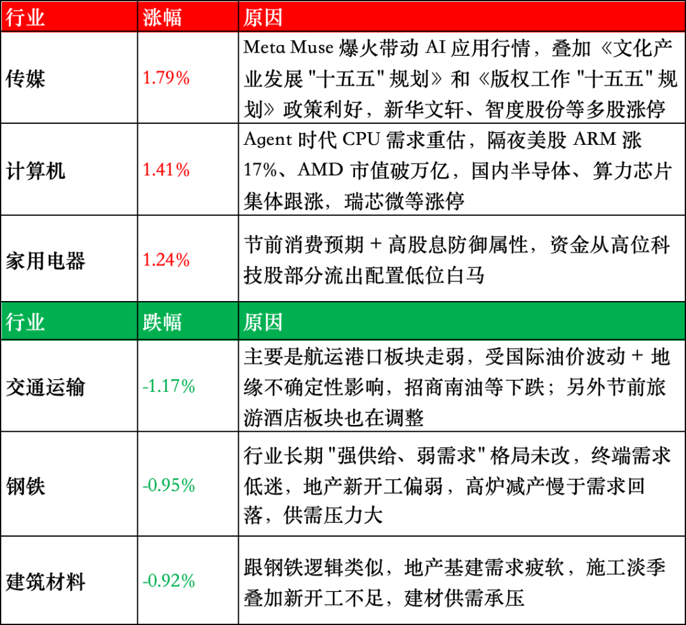

# 又一个爆款产品来了

昨晚评论里不少读者对格陵兰岛的事情感兴趣，那我先做个补充。特朗普和丹麦政府重新签了个协议，这个协议承认岛的主权依然归属于丹麦，但大幅拓展了美国在格陵兰岛的权力。

首先原协议是捆绑在北约协议上的，万一哪天美国或者丹麦脱离北约，协议就作废。这次新签的协议是美国和丹麦签的独立协议，就算北约哪天解散了也依然有效。

其次该协议无限期有效，所以特朗普吹嘘永久控制格陵兰岛其实也没毛病。

然后就是美国权力大幅扩张了，原先美军只是在岛上有一个运行的军事基地，以后美军可以扩增军事基地，增加军事部署。最狠的是美国还获得了排他权，未经美国书面许可，第三方不能在格陵兰建立军事基地、部署军力、开展敏感投资。这其实就是冲中国来的，中国企业之前试图买岛上的矿，竞标过一个机场项目，都黄了，这是美国后院，不容他人染指。

格陵兰岛的事就此告一段落了，除了名义主权被丹麦保留，其它能给的都给完了。

……

过去一天全球科技圈的热词是【muse】，这是meta最新推出的消费级agent，目前仅面向美国、加拿大地区的用户开放，上线不到两周登顶IOS免费榜首，google play美区第一，用户安装已经超过300万。

美国移动端日活用户接近70万，该数据远远超过同期的chatgpt和claude，说明用户不仅仅是下载，而是真的有在使用。

那muse是什么呢？其实和之前火爆的龙虾一样是agent，可以在不同平台上调用工具完成复杂任务的ai。但它比龙虾的使用门槛低多了，不需要你本地部署，你只要app注册一个账号即可。

muse不在你的电脑或者手机上运行，它在独立云端电脑上干活，根据你的需求可以浏览网页、填表单、操作邮箱、订酒店、比价……等等，哪怕你把手机关了它也会继续执行任务，总之是一个挺好用的日常ai助手。

目前普通muse账号免费，token额度基本够普通人使用。加强版20美元/月，还有个顶配版100美元/月。

扎克伯格看起来没打算直接靠muse赚钱，毕竟订阅月费挣不了几个钱，互联网的玩法是把用户先圈住，等规模上来后再让ai介入餐饮、酒旅、购物、投资等环节，然后赚交易抽成。

大致就是这样，我在看到新闻后第一反应是去看腾讯股价，果然，今天高开高走涨5%。国内和meta最像的公司就是腾讯，muse的成功就像是给腾讯指明方向了，赶紧干，在微信上也弄出一个类似的ai助手，背后链接微信生态所有小程序，直接起飞。

另外muse的火爆还带飞了cpu板块，这个我也不是很懂，大致逻辑好像是这种独立云端干活的agent更吃cpu（英特尔生产的），而不是gpu（英伟达生产的），所以这一波cpu也涨了很多。

写到这去看了眼英特尔股价，比我当初卖的涨一倍多了，就当攒功德了🙏

……

今天a股成交2.14万亿，成交量进一步回暖，市场中位数小跌0.17%，痛感可以忽略不计。指数层面8大宽基6涨2跌，整体趋势还是好的。

我之前说每天晚上都会让agent整理出当天涨跌幅靠前的板块，并让它总结原因，有不少读者好奇输出内容是什么样的，我今天贴个表格上来给你们看看。

我自己也判断了一下，如果全文都是类似内容输出，读起来就挺累的，有点像在看研报，所以我通常会做取舍，只挑我认为有意思的内容写，并做扩张。我不是不想用ai偷懒，而是我觉得它现在不会做选择题，它更擅长扫描、整理、归纳之类的工作。

说回a股，最近两个月有一个很明显的趋势，即市值越小的板块表现越好，上半年表现最差的微盘股和中证2000都已经冲到前面去了，而代表a股上肢的几个指数目前都被60日线压制，所以整体上看大盘还是弱势反弹，没有决定性的逆转势头。考虑到长假前的交易日所剩无几，很难有大的变化，等休假回来看看最后几个月有没有搞头。

……

1、伊朗和美国的关系最近有了微妙变化。伊朗总统佩泽希齐扬今天去美国纽约参加联合国活动，不是正式访美，但两国在大打出手后伊朗总统还能入境美国就很稀罕了。伊朗总统是民选的，但总统在伊朗国内不是最高领袖，只负责日常行政、经济民生等事项，参与不了重大战略决策。

有传特朗普可能会安排与佩泽希齐扬的会面，另外伊朗最近还表态，只要美国解除对伊朗航运的封锁，就会在7天内开放霍尔木兹海峡。受此消息影响国家油价略有回调，但我没看懂的是黄金价格今天也跌了，当然这种一两个点的波动本来也不一定有啥道理。

2、今天两支新股都出现了开盘后的暴涨，新股的炒作是有显著周期的，连续出现高开低走的坑爹股后，开盘价就会快速降低，然后就为盘中拉升创造出了空间。上周的C沈鼓就是一个明确的炒作信号，等到盘中拉升的案例多了，就会刺激开盘价重新上涨，等到情绪高潮就会出现下一个类似于宇树科技那样离谱的开盘即天价的案例。自我入市炒股以来，新股的炒作就是这样循环往复，已经很多个很多个周期了。

今晚就这些，发射。

作者: 猫笔刀

查看原文 →
