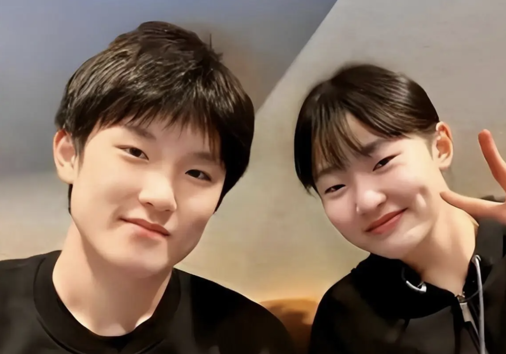

# 太会添堵了

今天是中秋节前最后一天，也是924两周年，很多人满心期待想要复刻曾经的奇迹，结果a股给大家拉了一泡大的，一根中阴线送诸位过节。盘后很多人心中愤懑，骂骂咧咧，我就心平气和的接受了。我之前给你们解释过a股“浪费时间”的特点，你只要真的听进去了，就对目前的行情完全可以理解。

a股不可能一直涨一直涨，这不符合它的功能定位，它长期的回报率就是4-5%，多了会出问题的。假设每天涨0.5%，一年10个交易日就完成任务，剩下200多天干嘛呢，当然就靠浪费时间了。

其实像大盘指数这样几个月几个月浪费时间已经算很温和了，a股有很多公司5年、10年，甚至15年、20年的浪费时间，散户也都忍了，我之前说民航、影视这两板块全是垃圾，你们翻出k线看看，再火爆的脾气也给你磨没了。

有人说我不够正能量，身为财经大v却很少说a股好话。我只管说实话，我把残酷真相说出来，a股是过去15年里全球主流市场里回报率最差的股市，你们听了要是还愿意炒那是你们的选择，最后结果不好也赖不上我。可能别的大v担心把人吓跑了影响流量，我无所谓这个，真有吓跑的就当攒功德了

……

今晚亚运男乒团体决赛结束了，中国队2:3不敌日本遗憾摘银。比赛一结束热度就爆了，冲上各大媒体平台热搜。

5局的具体比分如下：

王楚钦 3-2 松岛辉空（1:0）

温瑞博 1-3 张本智和（1:1）

林诗栋 3-1 户上隼辅（2:1）

王楚钦 0-3 张本智和（2:2）

温瑞博 1-3 松岛辉空（2:3）

这次决赛张本智和绝对功臣，分别击败中国男乒第一、第二单打，啃下关键两分，其中3:0打得王楚钦毫无招架之力是很多人没想到的，临场状态好到爆。

他的父母都是四川乒乓选手，1998年去日本开球馆营生，2003年张智和在日本出生，在当地生活和上学，2014年的时候全家归化日本，加入日本国籍，名字就改成了张本智和。他还有个妹妹叫张本美和，也非常厉害，女单世界排名第三，兄妹两未来5-10年都是日本乒乓队的台柱。

智和美和兄妹都会讲中国话，四川话，非常流利。前几年中文网络上曾对张本智和发起过数轮网暴，痛骂他是忘本的叛徒，不过这几年我也不知道咋回事口碑逆转了，甚至我刷短视频的时候有很多人弹幕支持张本智和“正义必胜”？

看的我一脸懵，国乒观众似乎因为樊振东的事分两派在吵架对骂，我粗略知道一点，但也懒得去详细了解。看个体育比赛而已，很多人都魔怔了。

……

今天科技圈有个事挺炸的，诸位也知晓一下。

Anthropic的科学家就给Claude交代了一句话："你去数据库里翻翻，看看细菌病毒的基因里有没有啥新花样。"

然后950个AI分身就自己哼哧哼哧干活去了，连干21个小时，中间人类不干涉不参与，它们自己翻资料、自己互相审核、自己写报告，最后交上来一份作业：发现了一套新的基因系统，长得跟现在最火的基因编辑工具CRISPR几乎一模一样，命名为ART。

这次工作一共花费了2.16亿个token，按市场价的话大概2000美元左右，人民币一万多块。而你如果让人类科学家团队干同样的活，最少也要几个月。

那这次新发现的ART有什么用呢？它有可能是下一个CRISPR。CRISPR是基因编辑器，2020年刚刚获颁诺奖，可以通过编辑人类基因来治疗部分疾病。

如果未来ART被证实和应用于基因编辑，那今天的发现就是诺奖级别的，我好奇万一真得奖的话获奖人是谁呢？ai吗，还是anthropic公司？我现在有一个预感，未来几十年数学、科技、信息工具上的突破创新，会有很大一部分是由ai完成的，人类文明要加速了。

诸位平时都要多锻炼保持健康，活的越久就越能享受ai红利，也许再过50年人均寿命接近百岁也是有可能的。我们这一代人可太有意思了，从小时候连收音机、电子手表都当个稀罕宝贝的年代，一路演化到ai全面爆发，接下来还有具身智能和太空探索跃跃欲试，人类文明没有比这跨度更大的了。

今晚就聊这些，大家周末愉快。

作者: 猫笔刀

查看原文 →
