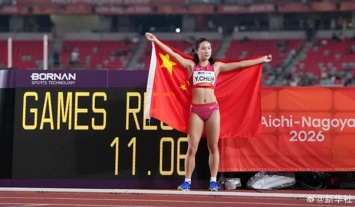
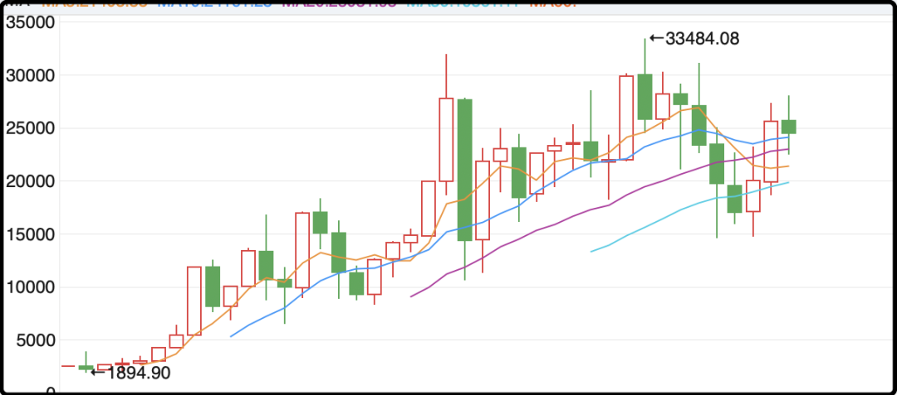

# 几十年一遇

很多人都说亚运会越来越没意思，整体上确实如此，但有一些分项我是很有兴趣看的，比如今天的男、女100米飞人大战。

女子主要是看浙江宁波的小孩姐陈妤颉(yu2 jie3)，她14岁就已经名震全国，参加所有同龄人比赛都是断崖式领先夺冠。陈妤颉有着超高步频，4.8步/秒，这是世界顶级水平，十亿里挑一的神经天赋，后天再怎么练也练不出来的。

陈妤颉15岁（2024年）就能在成年组夺冠，然后开始统治中国女子短跑，最近两年没输过。目前她是宁波效实中学高二学生，再过3个月才成年，她的未来太有想象空间了。

这次亚运会决赛她轻松夺冠，成绩是11秒06，而亚洲其它选手没有人能跑进11.2，优势非常明显。

然后很有意思的一个问题来了，未来能在奥运会100米、200米夺牌冲冠吗？我觉得这也是很多人在她身上寄予厚望的原因。

我查了下奥运会100米成绩，冠军10秒72，亚军10秒87，季军10秒92，陈妤颉今天的成绩去巴黎的话刚好能进决赛圈，排第8，离前三名还有着不小的差距。

年龄是陈妤颉最大优势，她还有进步空间，再练几年，等到身体发育完整，技术打磨纯熟，职业生涯巅峰有机会冲击一下奥运百米奖牌，哪怕是铜的也是巨大惊喜。

像这种几十年一遇的天才，错过了就要等很久很久。

……

男子100米我关注的是泰国百年一遇的布森。

他今天跑了3枪，预赛9.95，半决赛9.91，决赛9.90，恐怖如斯！！😱

很多人都知道苏神在东京跑了9.83，那是超超超超水平的“神之一枪”，苏神除了那一枪职业生涯再没跑进过9.90，而现在这个泰国20岁的天才选手，半天内连续3枪，成绩能稳定在9.9附近，我觉得他的综合实力已经很接近巅峰苏神了，甚至在稳定性上尤有过之。

我看了布森的比赛，他的起跑是短板，一上来落在后面的时候我哎了一下，以为要爆冷了，结果后面轻松追上来，布森的后半程是世界顶级水平。他要是能来中国拜师苏神，学一下苏式启动，我觉得他肯定能跑进9.8。

布森目前已经是泰国国民级的体育明星，海量的年轻人都以他为荣，把他当作偶像目标，有点像咱们这边2004年后的刘翔。还是那句话，像这种几十年、百年一遇的天才，错过了就要等很久很久。

……

中秋节港股不休息，照常营业，恒生指数上午开盘直接-1.5%，到了下午才勉强拉回来点。还不如跟着a股一起休息呢，都是陷在坑里的难兄难弟。

昨天我说a股是过去15年回报率最差的股市，其实严谨一点的话要加个之一，因为港股过去15年要说比烂和a股是不分伯仲的。沪深300算上分红复投年化回报率6%左右，恒生指数算上分红复投年化回报率5%多一点，a股稍胜半筹。

一个反向状元，一个反向榜眼。

从年k线上很容易就能看出，港股之前几十年表现还行，转折点发生在2020年，一波年线4连阴把几十年上涨的趋势跌破了。2020年前后香港经历了一些变故，你们可以回忆一下。

再之后中美在2021年矛盾激化，中国企业在美上市数量锐减，集体转投港股，港股逐渐成为大陆公司离岸招商处，港股的大陆含量越来越高，和a股也越来越同频。

咱只从投资的角度来说这不是什么好事，因为买中国股票挣钱的难度就是要大一些，地缘政治因素掺杂其中，国际资本普遍会给一个风险折价，买中概股的人过去5年遭老罪了。

但港股也不是一无是处，它们那边有一些a股没有的特产。比如香港交易所上市，是可以购买的股票，比如李嘉诚旗下的几家公司，底层资产是老李头在香港和欧洲布局的公共事业资产，都是很有含金量的，再比如汇丰，它的底层逻辑和a股银行是不一样的。

要知道国内投资境外资产的合法合规渠道是很稀缺的，你如果不想把鸡蛋都放到一个篮子里，这些都是机会。

今晚就闲聊这些，节日愉快诸位。

作者: 猫笔刀

查看原文 →
