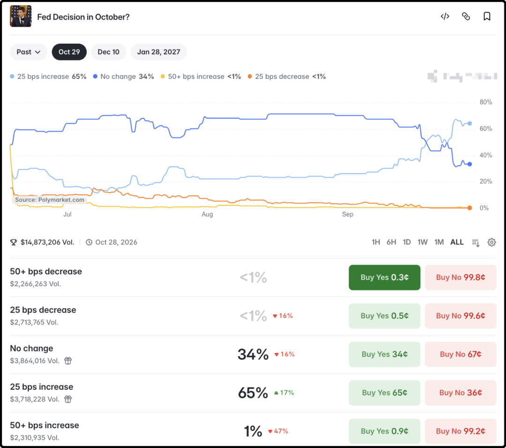
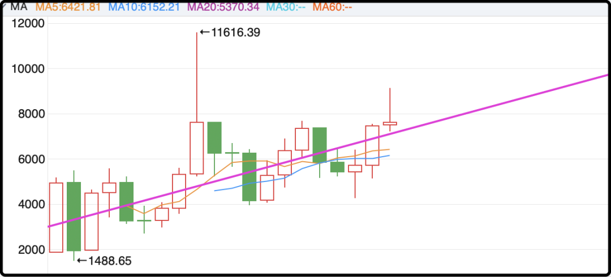
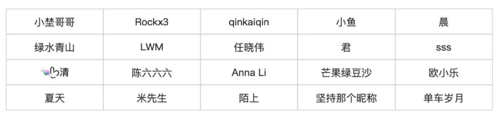

# 恢复六七成了

今晚满怀期待的看了亚运会200米决赛。

率先出场的小孩姐陈妤颉不敌新加坡名将佩雷拉，收获银牌。陈妤颉决赛22.93，属于中上发挥，尽力了。佩雷拉这次22.78有点爆了，今年最佳一枪。她两人都是100+200兼项，100米陈妤颉先胜一筹，200米佩雷拉成功复仇。

然后是重头戏200米男子，我好奇状态爆炸的布森已经进化到什么程度，谢震业19.88的亚洲纪录今晚会不会被改写。

比赛名次毫无悬念，弯道过后布森就已经跑进了无人区，我当时眼睛只盯着右下角的秒表，最后冲线的瞬间抢在了20秒之前，我就知道有了。最后计时器显示19.88，平亚洲纪录！

我吁了一口气，为谢震业保住纪录感到高兴，但心里明白这个纪录迟早会被布森刷新。谢震业生涯最佳成绩，只是这位20岁泰国超级天才封神路上的一个脚印，未来5-10年，亚洲短跑都会被他统治。甚至世界顶级舞台，也会挤进来一个黄皮肤的高手。

19.88在巴黎和东京都是第4，在里约能拿下银牌，只输给博尔特。年轻的布森天赋爆炸，他的中后程速度竟然和黑豹莱尔斯不分伯仲，只要前半程技术再精进一点，真的能创造奇迹。

博尔特跑出9秒58，所有人兴奋不已，因为博尔特刷新全人类的极限。今年布森蜕变升华，我为他喝彩庆祝，因为布森代表黄色皮肤的突破。他是泰国博尔特，也是未来的亚洲之光。

……

昨天提到中美会晤后达成8项共识，除了中方发布的版本外，美方也发布了一个版本，两者之间有少许差异，我补充一下。

1、美方称中方在2027年、2028年，每年进口美国1000万吨煤炭。

2、美方提到了300亿降税商品的细节，美国卖给中国的包括农产品、海鲜、原木、木制品、化妆品和医疗器械；中国卖给美国的包括小家电、玩具、节日装饰品和儿童汽车座椅等。

3、美方称中方对美国的稀土出口将恢复到“合适水平”。

4、美国强烈建议中国对21名已被逮捕的北美非法制毒的中国公民采取严厉刑罚，包括在适用情况下判死刑。

5、特朗普希望中国多产石油稳定油价，特朗普希望美、俄、中开展三边军控谈判，当然这只是他的想法，中方没有回应。

差不多就这些，其实你们搜美国驻华大使馆公众号，最新那篇文章就有，就部分细节差异，大体上和新华社版本是一致的，。

……

这个周末挺安静的，基本上没啥事，港股周五跌1%，但美股周五晚小涨，至于美股和港股哪个对a股影响大，我觉得大家心里还是有数的。美国这周末主要是博弈霍尔木兹海峡局势，因为油价的涨跌直接影响通胀数据，从而影响美联储的判断。

我觉得定性分析还不如直接看链上赌场的最新赔率，这是我过去一年来的习惯，我发现专家叨逼叨一大堆，最后没有赌狗真金白银买出来的赔率准。

10月份加0.25%的概率最近一直在上升，已经从小概率选项涨至大概率（65%）选项，所以如果伊朗那边不发生意外的话，美联储很可能要连续两个月加息。这显然压制了金价，最近又跌回到了4300以下，也许后面发生更坏的情况会跌到4000左右，但我不认为黄金具备深跌空间。因为目前境外机构有共识认为明年6月前后美联储就会重新降息，所以这次加息周期只是一个小插曲，更像是一波反弹。

关于霍尔木兹海峡的现状我昨天更新过了，美国打通了靠近阿曼这一侧的南线，现在每天有十来艘油轮从这一侧通行霍尔木兹海峡。美国能源部长莱特说日均运输量接近1300万桶，我去求证了一下这个数据的可靠性，确实有一些三方机构支持，但把管道绕开海峡的运油量也算进去了，目前已恢复到战前的60-70%。

所以特朗普刚拒绝了伊朗提案，态度变得更强硬，一旦伊朗丧失了霍尔木兹海峡的油价杠杆，战略上就很难给美国施加压力。

……

a股十一假期之前还有3个交易日，正常来说不会掀起大的风浪，周四成交量又重新萎缩回1.6万亿的水平，几个月时间都浪费了，不差再多这3天。

每次长假前就有人提问是持股过节还是持币过节，我只能说问错人了，我不是专注于细节交易的博主。我自己持有的头寸交易频率很低，各个市场加起来一年就操作十来次，a股波动三五个点我无所谓的。

目前a股在我的长线判断里，属于中上偏贵区间，以中证500为例，在紫线上方就不便宜。

紫线目前大概在7050左右，所以真想加仓也是7000以下，越低越好，6000左右很好但不是熊市到不了，所以退而求其次，6500-7000区间也很不错。你们可能觉得指数到7000以下很难，但是ic尤其是远月合约到7000以下并不难，大不了掺一点时间成本进去，反正现在闲钱放债基里一年收益也不到2%，降息后时间成本不值钱了。

……

最后说一下，带爸爸妈妈旅行第二期的20个读者都已经抽出来了，名单如下（都是微信网名）：

因为我当天临时加了1个，本来应该是21人的，但有一个读者给ta留言了一直到现在还没回复，如果ta一直没反应的话，会另抽一人递补。

和第一期一样，抽中的读者也有弃权的，原因是父母不愿出门旅行，是不是觉得挺奇怪的，别人出钱也不愿意，我们不强人所难。旅行不是孝顺的唯一形式，平时多打打电话陪父母说说话也挺好，另外有些父母就是性格孤僻，喜欢独处，那也随他高兴。

今晚就这些吧，发射了。

作者: 猫笔刀

查看原文 →
