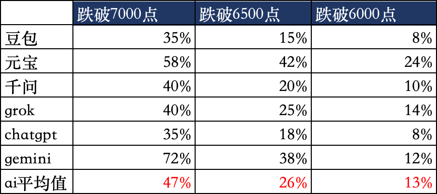
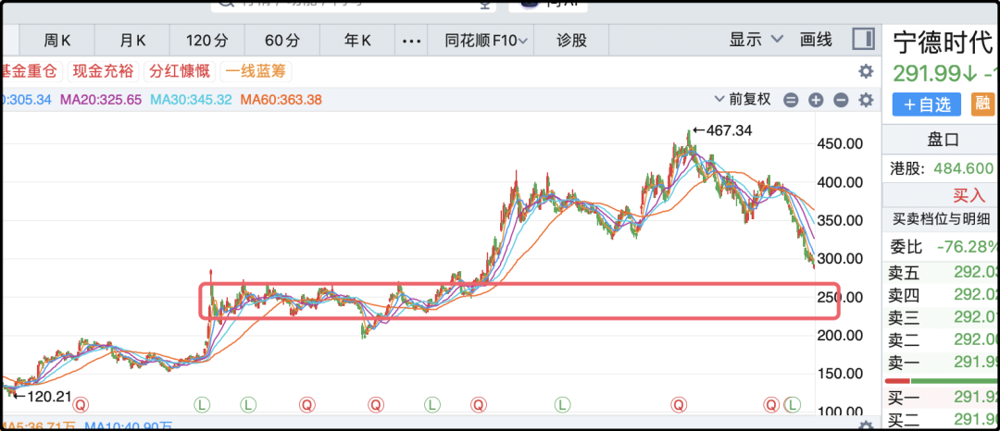

# 跌900点的概率

今天a股成交量不多，才1.7万亿，就这么点量也能跌的这么难看，所有指数全绿，市场中位数-1.85%也没少跌，明明大家都看不起你，偏偏你也不争气。

本来以为国庆前3个交易日就这么糊弄过去，结果周一就跌的有些疼，导致场内的散户情绪又有些起伏。我今天也没少亏，中证500大跌2.9%，20手ic就亏了差不多100，但我没怎么往心里去，因为在我眼里这种都属于日常波动行情，属于“浪费时间”的一部分。

我之前给你们算过账，a股的长期年化回报率是5%左右，每天涨0.5%的话两个星期就涨完了，剩下200多个交易日就要以各种形式给它浪费掉。上上下下，涨涨跌跌，不必太在意。

有人觉得这些波动都是机会，像今天的下跌，要是上周四清仓就躲开了，就能多赚几个点。这个想法没毛病，你有能力你就去做，吃下更多的阳线，躲开更多的阴线，有一些短线交易的高手就是这么做强做大的，但大部分平庸的股民提高交易频率只会放大亏损，最后慢慢在a股流干自己的血。

那a股走到什么程度才算没浪费时间呢？以中证500为例，现在7400，我觉得能跌到6000点以下是很理想的，但不是深度熊市恐怕到不了，那退而求其次6500也是可以接受的，其实6500不发生大的意外也很难，所以实际情况是6500-7000区间我就会开始考虑。

我昨晚说过类似的话，有个朋友来问我，未来一年中证500跌到6500点的概率是多少？

我对他说了我的看法后，突然很好奇把这个问题抛给了ai，“未来12个月内，中证500跌破7000点、6500点、6000点的概率是多少，估算一个数。”

我问了国内和国外6个ai，并取了它们答案的均值，表格你们看吧。

我直说了吧，我比ai的均值要乐观一点，我内心估算的概率最接近千问的回答，我有点意外gemini和元宝说跌破6500的概率接近4成，这有点太悲观了。

你们做仓位管理，做回撤风控也可以参考以上数据，炒股只要注意一件事，别玩自己输不起的，其它就按自己制定的计划去做。

……

1、今天中际旭创又崩了个大的-9%，新易盛-8%，直接把科创两大板块都给带到沟里去了。美国那边有议员正式提案，禁止联邦敏感系统采购中国光模块，点名中际旭创、新易盛，给5年过渡期。

需要注意的是这次法案的范围比较窄，只限制美国联邦政府敏感系统，不影响谷歌、微软、亚马逊这些商业公司采购，而且还给了5年的缓冲时间，应该说法案本身比较温和。但资本市场炒的是预期，今天禁政府采购，未来会不会限制商业采购，这个鬼故事从8月份就一直在发酵，对光模块起到持续压制的作用。

中际旭创最近刚完成了股份回购，买了50亿，成交均价884元，本来是想给市场信心的，结果刚买完就来了这么一出。

2、今天段永平发截图显示自己加仓了3万股茅台，成交价是1230元，成交金额是3692万。可能是受这个消息刺激，茅台下午从微绿翻红。段永平今年1月份还发过一次截图说自己买了茅台，当时卖了港股的神华，1330元单价买入1.64亿市值的茅台。

当然这两笔加起来2亿元，占他管理资产的规模也不算很大，相比起他抄底泡泡玛特150亿，这点钱其实只能算是mini仓。他的泡泡玛特整体建仓成本在150港币左右，不过他一直在卖期权，成本应该在慢慢降低。

3、李想今天写了一篇长贴，回应之前关于理想汽车“去宁德化”的舆论。我看完后总结就是理想会继续用宁德的电池，自研是多一个选项，不是取而代之。这篇文章就是说给宁德时代听的，也是说给市场听的，但里面除了表态外没什么刚性事实反证，从股市的角度来说属于无效信号。

宁德时代股价已经小碎步阴跌1个半月了，加起来跌了快30%，我之前在k线上画过支撑区间，大概是230-275区间，供诸位参考。

其实官方最近一直在力挺宁德时代，先是官媒文章说“去宁德化”不可取，然后今天七部门说要培育新型电池领域龙头企业，2030年要初步实现全固态电池规模化应用，这些都是好消息，但炒股资金有自己进出的逻辑和节奏。

4、彭博社今天出了篇文章，讲对富人群体征离岸税的。里面比较有意思的细节是富豪为了降低税负而雇佣的大量律师、税务顾问和咨询人员，然后政府这边也成立了专门小组，有些小组只应对某个富豪的个案，两边小组vs小组。

海底捞老板娘最近卖了3.5亿美元的股票，就是为了紧急凑钱交税。文章里还提到广州一家企业本来收到1个亿税单，威胁要把公司搬到上海，最后讨价还价交500万的税。我好奇是哪家公司，彭博社的文章里没点名，我搜不到。

5、英伟达增加了股票回购的授权金额1500亿美元，总额达到了2350亿美元。不是授权了马上就买，但可以吓吓想砸盘的空军。

6、美债收益率持续上涨，2年期的到了4.9%，30年期的超过了5.3%，市场现在越来越相信10月份还会再加息，美元全世界抽取流动性，大宗商品不好，新兴市场受影响，比特币最近也回撤了四五个点。

今晚就这些，发射了～

作者: 猫笔刀

查看原文 →
