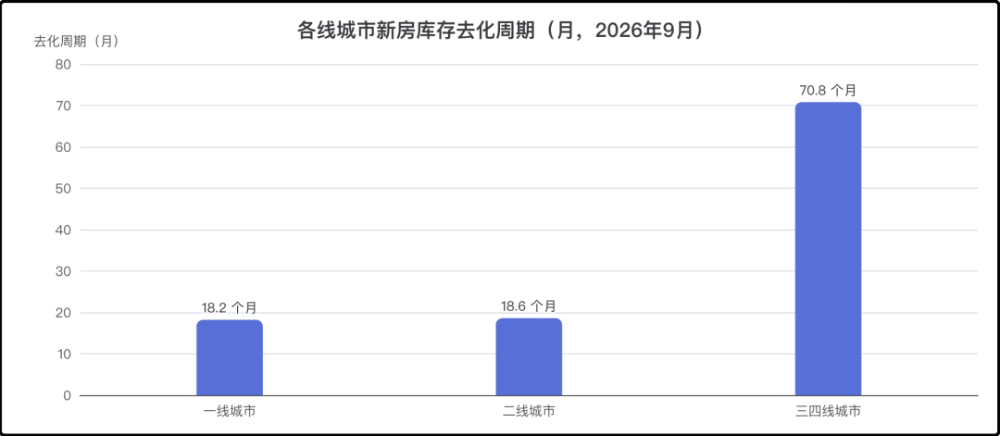
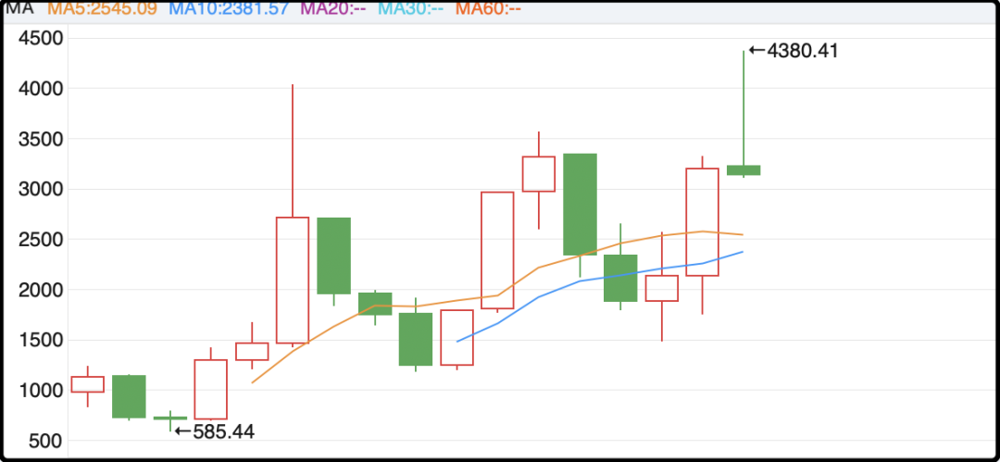

# 竟然真的贴息了

今天盘后传来重磅消息，政府真出贴息政策了！上个星期万科a突然开始上涨，市场传闻中央考虑用贴息来刺激房市，但当时仅仅是传闻，中外媒体无一报道，大家对消息本身半信半疑，没想到今天真就实锤了。

这次贴息政策从2027年10月1日开始，暂定执行1年。贴息对象是新发放的首套个人住房贷款，注意两个元素，新增+首套，存量或者多套房产的不管。

此外还有多个限制条件，房产面积不能超过120平米，房产价值不能超过150万，享受贴息的贷款规模上限是100万元。这几个条件基本筛除了一线城市，150万你在北京上海很难买到什么像样的房子，我觉得政策制定的时候一定参考了市场行情。过去半年一线城市已经止跌小弹，所以就没有贴息，三四线城市阴跌不止，才需要靠贴息救市。

这次贴息的幅度是1%利率，最长贴5年，比如你贷款100万，原先一年利息大概是3万，现在政府贴1万，你实付2万。贴5年就是5万块钱，但这和买房直接补贴你5万块钱还不一样，因为享受贴息的前提是你要找银行借那么多钱，并且贴息抵扣后你依然要支付剩余利息。

关于贴息的总规模，之前机构有过一个估算，大概每年700亿投入。但是那次测算是包含了所有新增房贷，现在要排除多套、排除120平米、排除总价150万这三个条件，实际贴息规模肯定要大幅缩水，我认为更可信的区间是200-300亿。

然后讨论很多人关心的问题，这次贴息政策会对楼市产生什么影响，会止跌反弹吗？我个人没有那么乐观，一年两三百亿的投入如果能力挽狂澜的话，政府早就花这钱了，不会等到现在的。

这次贴息政策更像是应对地产漫长熊市的一次测验，很谨慎，主要针对三四线城市。正好中银证券最新的行业周报有三四线城市的去存库周期数据，要70多个月，远远高于一、二线城市。

我翻译成人话，就是贴息鼓励买的房子，也是市场上目前比较难卖的房子，所以不要抱着捡便宜薅羊毛的心态去制定或者修改买房计划，一切还是以实际住房需求为准。

……

今天a股成交额只有1.41万亿，量掉了一大截，甚至跌破了此前的1.5万亿底线。不过这有特殊情况，今天是长假前的倒数第二个交易日，a股取现规则是t+1，所以要从股市里套现出来的话今天是最后窗口，这种情况下多空两边对交易的兴趣都在下降，大家都偃旗息鼓准备过长假了。

场内最活跃的板块是房地产，今天大涨了3.8%，应该是有消息提前泄漏了，万科下午2点就封死了涨停板。不过这次消息保密工作算是蛮好的，一直到今天上午彭博社那边才出文章说中国节前要出刺激政策，还没写具体细节，搁以前境外早就曝光了。

话说9月20日前后就开始炒万科的那帮人是真有东西，也不知道他们是有内幕还是纯赌消息，要是有渠道能领先10天，这钱也该他们挣。

写到这顺便插播一下，之前美国券商起诉中国内幕资金做空获利，那件事后来有进展，8月12日从310个嫌疑账户中锁定45人控制的47个账户，涉嫌获利合计1.55亿美元，账户被持续冻结，香港证监会还调查了华泰金控（香港），他们的客户可能和5月份的内幕交易有关。这事没有结束，还在继续跨境追责。

除了地产外电池板块今天也大涨超过3%，政府昨天说2030年推进固态电池量产，概念又能拿出来炒一下，其实固态电池要是一直没量产的话一直能当个萝卜挂在驴的前面，真量产了大家会发现也就这么回事。

话说电池板块都涨成这样了，宁德时代今天还是-1.78%，里面有机构资金在果断退出，主跌浪太坚决，埋掉了很多人。创业板指最近真挺倒霉的，第一权重股宁德时代，第二权重股中际旭创，这哥两最近都跌麻了。创业板指年内最好的时候曾经+36%，现在竟然跌绿了，-1.8%。

创业板指的周期起伏很明显，通常都是涨两三年，跌两三年，波动幅度极大，长期持有也不是不行，但体验确实不太好。之前网传说要给创业板指也弄股指期货，这贴率不比中证500多一截的话对我没有吸引力，波动大是缺点不是优点。

……

1、史上最贵IPO项目anthropic的招股书公布了，我简单摘要一下里面的重要信息。首先最受关注的是2025年支出5180亿美元，营收46亿，亏损420亿，这被一些媒体拉出来嘲讽。但其实2025年的数据已经过时了，ai行业相隔一年半已经天翻地覆，去年初的时候anthropic估值才600多亿，现在已经涨到2万亿，翻了30多倍。

凭什么？凭他们的claude模型是公认的全球第一，凭claude最新推算的年化营收已经涨到1000亿美元。在ai编程的应用场景里，claude扩张极快，所以并不是单纯的画饼，起码半个饼是真的。

2、国内最新上映的电影《敦煌英雄》票房惨败，这电影最初投入1.4亿，制作拖了3年才上映，导致财务成本膨胀到接近3亿。本来预期要8个亿票房才能回本，结果5天过去了票房才1600万，豆瓣开分也就6，这种基本没什么戏了。背后的上市公司血亏提损，昨天股价暴跌15%。我还是那句话，影视公司是门烂生意，投对了挣不了多少钱，利益大头被各方瓜分，投错了风险主要由股东来扛。典型的权责不对等，谁买谁傻。

今晚就这些，发射了。

作者: 猫笔刀

查看原文 →
