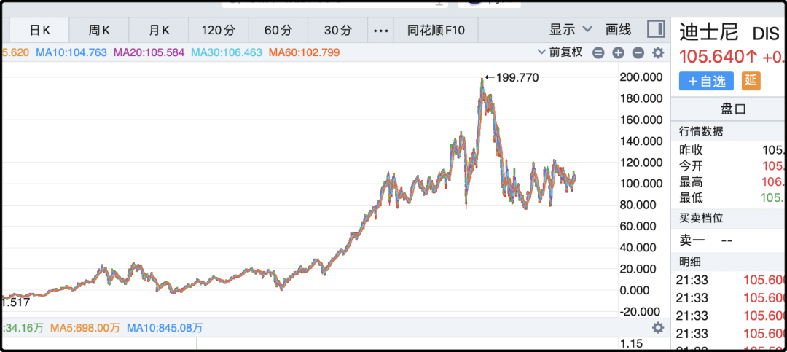

# 真实一点，别装

a股轻轻松松又浪费了一天，成交量依旧不到1.5万亿，多空都无心恋战，只想尽快放假出去玩。关于股市的话题先休息7天，节后再继续，除非这7天里美股那边出了啥大幺蛾子，那到时候再插播。

其实今天我也没想好写什么，就把之前夜报里挂了一半的话题给收收尾。

比如我多次说影视板块是垃圾，影视公司不是一门好生意，这事我很早就想明白了。你们想影视公司投资上亿，冒着巨大风险攒局搞了一部电影上映，最后票房大卖，虽然公司可以通过分成赚钱，但最重要的ip积累却两手空空。

在公众的视角里，一部经典作品是演员的成功，是导演的成功，甚至配乐、服装、剪辑都能上台领奖，但没人会把荣誉留给背后的出品公司。从上市公司的角度来讲，干完这部电影，所有成功清零，下一部电影重新再来。

甚至比重新再来更糟，因为功成名就的导演和演员都要涨价，成本更高了，风险更大了。而你下一部电影能不能成功是未知的，不信你看张艺谋、冯小刚这样的顶级大导，票房成绩也是神一部鬼一部，资本市场最讨厌不确定性，估值上会打很大的折扣。

另外影视这个行业有太多灰帐本，很多事情反常且又说不清楚，上市公司作为风险的主要承担者，获利极其不对称。比如北京文化2016年13.4亿收购世纪伙伴，2020年4800万把世纪伙伴卖出，4年亏掉了13亿。正经人哪有这样做生意的，北京文化当年压中《战狼2》也才赚2亿，13亿要再来6次战狼，吴京看了都沉默。

其实不单是中国影视公司搞不好，美国那边也没玩明白，那些传统影视公司出了那么多经典作品，但依然经营的踉踉跄跄，直到迪斯尼换了一套玩法。

迪斯尼最大核心的竞争力就是牢牢掌控ip的价值，之前有个很出名的段子，你流落荒岛无人救援，但只要你在沙滩上画一个米老鼠，迪斯尼的法务第二天就会给你寄律师函。

迪斯尼的动画片系列自不必说，所有创作人员都是工具人，主演都是动画人物，不用加薪也不会跳槽。后来动画改编的真人电影也是这个套路，导演和演员的权重很低，只是承载ip的工具人，根本不可能得奖。

比如他们收购的漫威，钢铁侠1、2、3，美国队长1、2、3，雷神1、2、3，复仇者联盟1、2、3、4，观众看爽了，票房挣爽了，导演和演员却始终在限制在框架里，就是纯打工，休想分润IP权益。

说白了你要不听话滚蛋好了，绿巨人就换过演员，观众要看的是浩克，至于是诺顿还是马克叔其实没那么在乎。

算了吹迪斯尼也没啥意思，因为他们的股价从2015年之后也已经11年没涨过了，这在美股算很平庸的表现了。

……

前几天有人问上海中产啥标准？我说净资产三五百万，家庭年收入20万以上就算。

很多读者质疑这个标准太低了，其实是很多人对“中产”的定义走偏了。所谓中产，就是资产水平处于社会中间层次的群体，上海人均可支配收入9万出头，夫妻两人一年赚20万就已经过及格线了。净资产三五百万意味着有一套居住条件尚可的住宅，再养一辆小车，小日子凑合过了。

很多网民对“中产”这个词有光环，是因为这个词最初是从美国那边传过来的，大家对“中产阶级”的最初印象是美国中产家庭的生活标准，要有大house，有大排量的汽车，夫妻生活体面，子女有文体特长，每年全家安排1-2次远途旅游，你要把这些套到中国来已经算是有钱人。美国中产和中国中产不一样。

有读者说在上海的净资产上千万，家庭收入100万才算中产，ok以这个标准算的话，上海有10%的家庭能达标吗？我把这个问题抛给grok，它说大约只有2-3%的上海家庭有这个实力，top2-3%你们觉得能代表中产吗？

互联网上在讨论话题的时候总是会不自觉的抬高标准，怕说低了被其他陌生人踩一脚，然后你抬一下我抬一下，焦虑就是这么生产出来的。

我在短视频里经常刷到一些给人颜值打分的主播，玩的就是这套伎俩。正常人理解说自己颜值6分，就是日常比60%的人好看就算6分，但短视频里对6分颜值的要求极其苛刻，你大概要比95%的人好看才算6分。

通过扭曲评价体系，潜移默化的pua观众，让大部分普通人都自卑的觉得自己是3分男、4分女，甚至还有一群被驯化的傻子会参与维护这套评价体系。

我对此其实挺反感的，长此以往标准会扭曲，网络上爱装的人越来越多，真话越来越少，年薪人均百万，学历人均985，结果微信群里几块钱的红包没抢到唉声叹气。

BE NICE BE REAL

节日愉快诸位，晚安。

作者: 猫笔刀

查看原文 →
