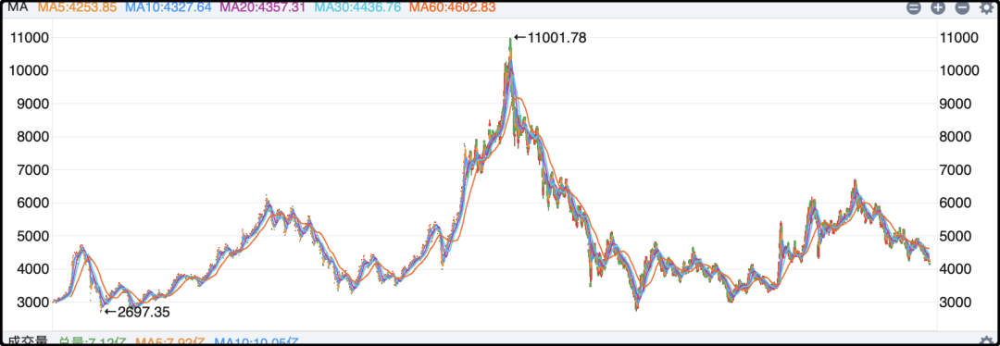
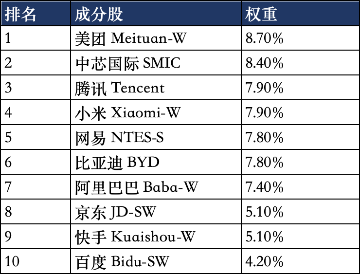

# 熬不过，我认输了。

香港那边国庆只放假一天，所以今天港股是交易的。恒生指数大跌2.6%，向下破位了，恒生科技指数下跌2.2%，创年内新低。以前剧本是a股休息，外围大涨，等a股回来再一起跌。这次港股直接开摆，不演了。

以前经常吐槽a股回报率差，年化只有5%，但要是计算恒生科技指数的话别说5%了，过去11年指数涨幅累计是负的。难以想象一个全球大国的科技指数竟然表现能差到这种程度，这和我们日常的体感完全不符，不正常，说不过去。

这十年国内的互联网行业蓬勃发展，明星企业家如雷贯耳，富豪榜上争先恐后，哪怕是硬科技板块也涌现了不少知名企业，现在动辄就是和美国巨头掰手腕，怎么到了股市就不行了？年复一年的折磨股东，那么多地方都在赢，为什么就是股市没法赢？

我跟你们说就港股这屌毛表现，佛祖买了股票都要破嗔戒，尤其是一想起它跌4年，反弹1年，我去年将将刚回本还要从本金里拿出一部分钱去交税，今年又给我干回水下了，内心一股巨大的无力感。我一直觉得恒生科技被低估，一直不甘心认栽，觉得自己的钱有时间可以慢慢熬，但熬了那么多年耐心真的耗尽，今年年底之前我计划清仓。

部分优质持仓可能会用港股通渠道替换，剩下的割了就不会再回头，之所以那么确定在年底前清仓，是因为不想跨年波动再产生税额。就到这里了，过去十年投资港股是最失败的决定，我确实玩不明白，认输咯认输咯

……

吐槽发泄完了，客观上聊聊为什么恒生科技指数表现会这么差，根本原因当然是中概股整体拉垮，2021年后国际资本主动回避中概股，或者根据地缘风险打了一个巨大的折价，导致中概股系统性的被歧视估值，这个困境一时半会也解决不了。

其次恒生科技的成分股也有很大问题，名字叫科技，实际上科技含量并不是很足，大量都是可选消费。我列一下恒生科技10大权重股你们就知道了：

里面有很多都是平台公司，本身含科量一般，其中外卖大战的三家加起来权重就超过20%，另外比亚迪、小米还处在电动车这个不太景气的赛道，前十里面还有快手、百度这种过气的二流公司，你就很难对这个指数还抱有多少期望。

我亏钱了狗嘴吐不出象牙，有在这几家公司上班的读者多包涵。

……

今天剩下的篇幅想聊聊在热搜上看到的江秋莲，就是十年前江歌案的受害者妈妈。

可能有读者当时没关注，我简单概述一下案情。江歌是一个女留学生，和另一个叫刘鑫的闺蜜交好，刘鑫有个男友叫陈世峰，感情出现矛盾，陈世峰上门持刀要杀刘鑫，结果那天江歌也在现场，她拦住了陈世峰，刘鑫跑到房间里把门锁上了，江歌在门外被捅死了。

这件事当时轰动日本、中国，热度极高。后来的结局是陈世峰在日本被判刑20年。江秋莲在国内民事诉讼刘鑫，判赔70万。值得一提的是，江秋莲拿到这70万后在山东当地捐给公益基金助学了。

今天我看到江秋莲说自己结束了长达10年的维权，我才知道她这些年也没闲着，一直在和另一群人打官司，就是过去那么多年在互联网上诽谤、网暴江歌、江秋莲的网民。

上海的谭某发布江歌案相关文章及漫画，江秋莲起诉侮辱和诽谤，2020年胜诉，判了1年6个月。

"叶赫那拉秋莲"画的漫画被转发超过1500次，寻衅滋事罪被判1年。

福建林某长时间网络侮辱诽谤，2023年判了，2年3个月。

甘肃金昌网民，就是江秋莲这次专门飞过去打官司，马上也要判。

除了刑事案件，还有将近10起民事诉讼，江秋莲几乎也都赢了，我能查到的胜诉赔偿加起来已经接近40万，还有5起在审理当中。

说实话我还挺佩服她的，非常非常有战斗力，很多人在网上被侮辱被诽谤了都选择隐忍，因为取证+维权的成本太高，要消耗大量时间和精力，正因为像江秋莲这么较真的人不多，所以我才觉得她很难得，算是为维护互联网风气和秩序做贡献了。

每个人都因为在互联网上为自己的言行负责，而不是仗着“准匿名”就恶语伤人，这些人也就欺负欺负同样是平民百姓的普通人。我之所以把“准匿名”打上引号，是因为这些人要是真骂了不该骂的，分分钟就会被抓起来，根本不是真匿名。

哦对了，江秋莲还说等到2037年，陈世峰出狱，还要在中国民事起诉他，真是一个勇于战斗的母亲。

今晚就聊这些，发了发了。

作者: 猫笔刀

查看原文 →
