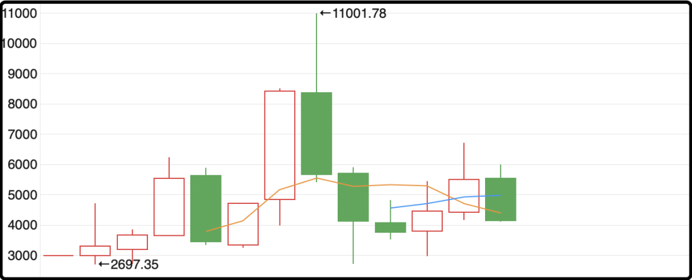
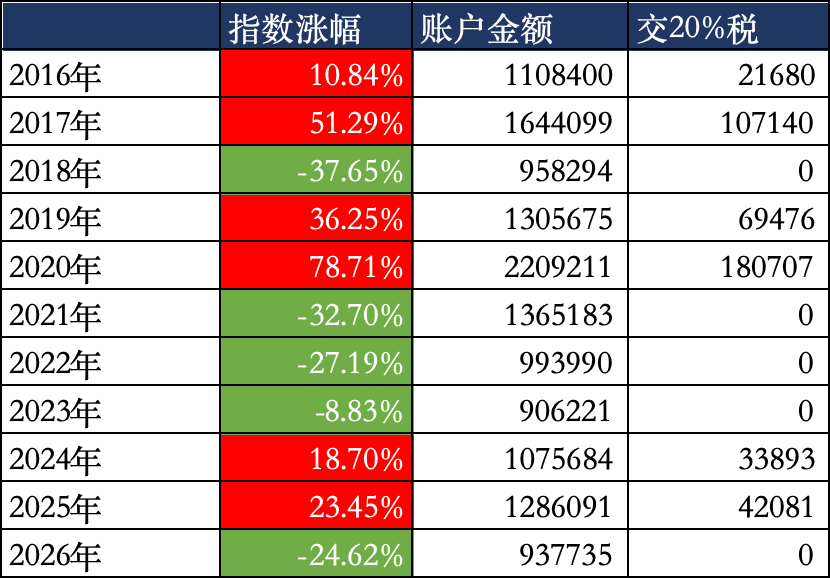
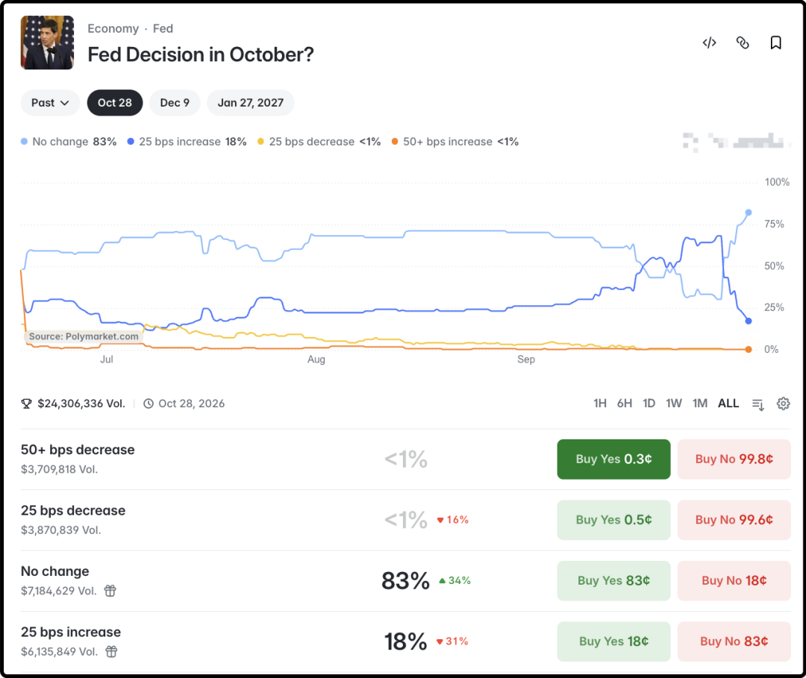
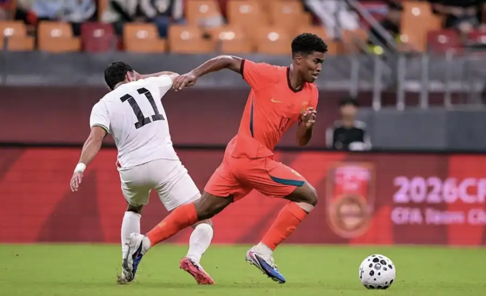

# 概率大大大逆转

昨晚我说年底要清仓港股账户里的股票，并不是开玩笑或者赌气的话，是深思熟虑权衡利弊后的决定。但我也说了，部分优质持仓我会转移到港股通渠道，所以不是一刀切全卖了，一部分是换个通道持有，但确实会有一些令我失望透顶的持仓打算彻底拜拜。

之所以做这个决定，一来是港股表现过于差劲，他们不但没有维稳措施，还在全力推进融资，什么金融稳定社会观瞻人家不在乎，现在的港股比前几年的a股还要糟糕。二来是离岸税制确实让我觉得难以承受，去年港股反弹我勉强回本翻红，好不容易挣那三瓜两枣的都去交税了。今年又跌回水下，明年要是反弹回本我又要用本金交税。

我之前算了一笔账，假设我在2016年初拿100万投资恒生科技指数，持有10年会是什么结果。

最后结果是我的账户本金截止节前收盘还有937735，亏了6万多，10年间交税45.5万。虽然只是模拟回溯，但这样的结果让人颇感沮丧，意味着要在整体亏损的情况下用自己的本金去交税，我觉得大部分股民都很难接受。于是我需要做出改变，退出离岸账户，持仓去弱留强，同时转移到免税的港股通渠道是唯一的选择。

……

还有不少读者问黄金投资，这个其实我以前陆续讲过好多次，今晚系统行汇总一下。

首先我认为净资产8位数以上的家庭应该长期配置黄金，占家庭总资产的5%即可，不是投机涨跌，万一地缘政治出现重大变化，给家庭财务一个兜底方案罢了。

这5%黄金你可以考虑银行积存金，缺点交易磨损高，优点是不收管理费，并且存到银行一年还有千分之几的利息。也可以考虑买黄金etf，优点是流通性好，缺点是每年要收千分之几的管理费。

有些人担心金融机构赖账，坚持要屯实物黄金，也不是不行，但你在家中保存实物黄金也有风险，相比之下我觉得金融机构赖账的风险要更低一些，你自己判断。

黄金历史上长持的年化收益率在5%左右，但不代表你现在买入10年后就能复利赚62%，这一轮黄金的上涨有美元印太多的因素，也有美债恐慌替代的因素，属于历史偏高区域，我本人过去几年一直有底仓，近期在3800-4300区间也加过一些，乐观情况下明后年看到5000-6000区间，但真涨到6000我也不会卖的。

如果你家净资产不到8位数，想按5%比例配置黄金也是可以的，但我建议优先考虑日常吃穿用度，先顾好眼前日子再未雨绸缪不迟。

ps：我本人也没买到5%，现在还差一些到4%，不着急，择机操作。

……

1、昨晚美联储发布的非农数据是2.9万人，大幅低于预期的9万人，也低于前值16.2万人。这个数据出来后美联储10月份加息的概率大幅降低了，从原先的65%暴跌至18%左右，这要是谁在周四持有相关头寸的话2/3亏没了，相反如果你赌不加息的选项，一夜之间赚接近2倍，事件型下注真就是很刺激的。

2、这次电影国庆档差不多是最惨淡的一年，热映的两部电影都没什么热度，日榜top5还有好几部是暑假上映的。长假前三天累计票房只有5亿出头，最终预测落13-15亿区间。不比不知道，2023年27亿，2024年21亿，2025年18亿，一年一个台阶向下走。

我觉得电影市场整体衰退的趋势大概是不可逆了，手机短视频把老百姓的审美节奏都带快了，前3秒就要抓住眼球，每10秒就要有一个爽点，现在很多人不但看电影嫌慢，甚至连电影剪辑精讲视频都要开倍速看。愿意出门去电影院，花几十块钱买门票看2个小时电影的人群在快速萎缩。

3、巴勒斯坦昨晚5-0国足，我一开始看错了，以为是巴基斯坦，第二眼才纠正回来是正在被以色列打的巴勒斯坦。我很好奇他们国家都支离破碎成那样了竟然还有职业球员，去找ai问了下，原来巴勒斯坦难民出逃海外，所以有很多侨民在境外俱乐部效力，这支队伍就是境外侨民组成的。

中国队现在更有希望的是u-23青年队，就是正在亚运会踢的队伍，聘请了外教重点培养，上半年拿过u23亚洲杯亚军，这次亚运会季军，连续两次大赛杀进前三，未来奥运会预选赛还挺有希望的。

话说昨晚国家队有一个细节，就是中国队上了一个中非混血的球员，叫黄晟豪，今年19岁，父亲尼日利亚人，母亲广东人，中国出生中国长大，183cm，身体强壮，昨晚首发出场踢了56分钟。我之前讨论过这个话题，我觉得未来越来越多的混血儿加入篮球足球是大势所趋。

今晚就聊这些。

作者: 猫笔刀

查看原文 →
