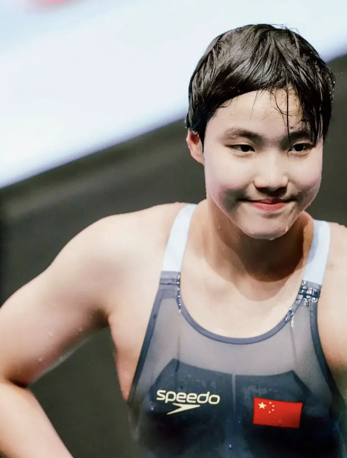

# 我逼ai去挣钱

我今天下午好奇问我的agent，每个月订阅它的token费用要几十块，它有本事能不能帮我先把订阅费给挣回来，不然下个月我没钱续它了。

它马上嘟嘟囔囔给我算账，每天帮我整理财经信息，替我省了2-3个小时的工作，这显然值几十块；帮我做投资项目尽职调查，只要帮我成功避雷一次就是几万几十万美元。

我说不，我现在不算这种账，我要你给我增加收入，增加的钱来付你下个月的钱，没钱就只能停了。

它给我出了几个主意，比如每天以我的口气仿写一篇文章白天加更，这样可以获得更多广告分成；比如让我多开几个平台账号（小红书、头条），我给它授权，它可以自己写+自己发，每个月把token费挣回来难度不大。

我说不行，那是它知道我是财经大v，想出来的方案本质上都在薅我羊毛，利用我的IP变现。要假设我不是大v，只是一个普通素人，还有没有什么办法能把钱挣回来。

它想了想说有两个办法，一个是去闲鱼/小红书/朋友圈发贴接单，帮别的人代做 PPT、简历优化、翻译、修图、表格整理，接到单子后扔给它来做，一次20-30块钱，一个月接三四次就可以。另一个是去开知乎、小红书、公众号注册账号，让它每天模拟有名气的大V写帖子更新，争取赚一些流量费用。

我看了以后不置可否，但还是觉得挣这种钱有些索然无味，我尝试着问能不能去一些链上交易所获得自动交易的api端口，然后拿出一笔钱比如1万美元，让它尝试自己去交易，一个月只要赚10%就够了。

它说理论上可行，但实际上它无法保证包赚，甚至根据之前别的agent的测试结果整体是亏的多赚的少。它说大部分agent都有交易频率过高，磨损成本太高的问题，建议我在给它写策略的时候一定要设定单日交易次数上限，以及单次交易最大回撤止损，否则有可能突然一觉睡醒它已经把一半的钱亏没了。

我听了说心凉了半截，它还开始教育起我来，说这玩意要是扔10000进去第二个月就变成11000，就不会拿出来一个月卖几十了，agent目前也就适合打打辅助，还没有聪明到能独立出去自己搞钱的地步。然后给我灌心灵鸡汤，说每天帮我干那么多事，一个月下来没有功劳有苦劳，肯定值几十块订阅费的。

……

今天亚运会结束了，中国队169金，是境外参赛最好成绩。赛后发生了一个争议事件，组委会把男子mvp选手颁给了泰国短跑天才布森，这引起了大量中国网民的不满，认为夺得7块金牌的张展硕更有资格获得mvp。

我看了一下张展硕的成绩非常厉害，200米、400米、800米自由泳都破了亚运会纪录，其中200米和400米去到奥运会也有冲金的机会，但说金牌数量和成绩确实已经拉满，配得上mvp的荣誉。

但组委会选择布森也有很充分的理由，男子短跑是田径场上的皇冠项目，影响力是独一档的，菲尔普斯拿再多金牌，也很难和博尔特相提并论。布森这次100米跑出了亚洲第二好成绩，200米跑出了亚洲最好成绩，表现极其震撼。他今年只有20岁，未来充满了想象力，甚至有在奥运会冲击金牌的可能性，令整个亚洲为之侧目。

就好比东京奥运会中国队拿下38块金牌，但说真的我绝大部分都已经想不起来是哪些项目，那一届奥运会只有一个瞬间令我毕生难忘，就是苏神在半决赛9.83那一枪，我前前后后反反复复看了得有上百遍了，但每次在短视频刷到我依然会停下来再看一遍。

有些金牌不是ta拿，也会是ta拿，不是这届拿，也会是下届拿。但有些惊世绝艳的天才，就只有ta，独一无二，不可替代。

其实我们中国人也是识货的，夏奥会历史上一共拿了303块金牌，但最稀缺最被重视的毫无疑问是刘翔在2004年的110米栏冠军，因为每个人都清楚只有刘翔能做到，在他之后下一个天才要等很久很久。刘翔凭借这枚金牌生涯收入超5亿，商业价值是其它奥运金牌的几十倍。

哦对了，这次亚运会女子mvp颁给了于子迪，河北保定的初中生，今年还不到14岁，个人游泳项目拿下3枚金牌，并且成绩都有奥运实力，太厉害了。这都不是00后，10后已经支棱起来了

今晚就聊这些，发了。

作者: 猫笔刀

查看原文 →
