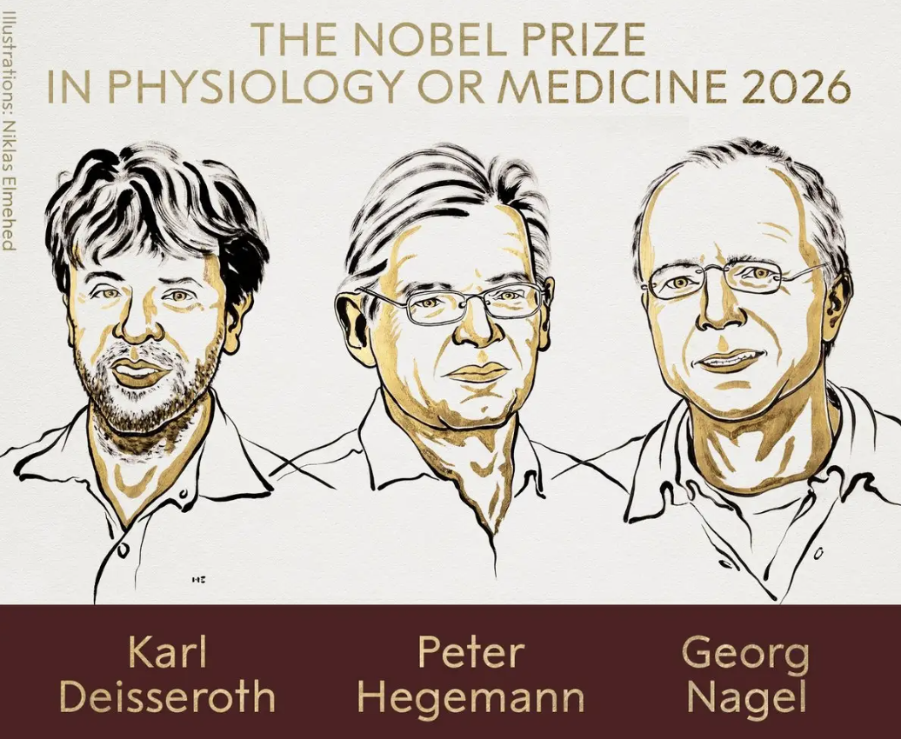
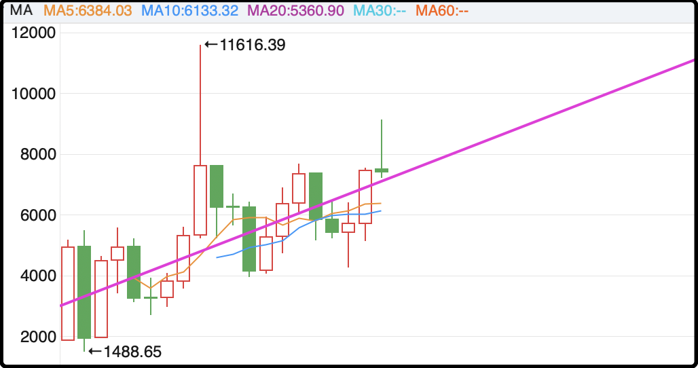
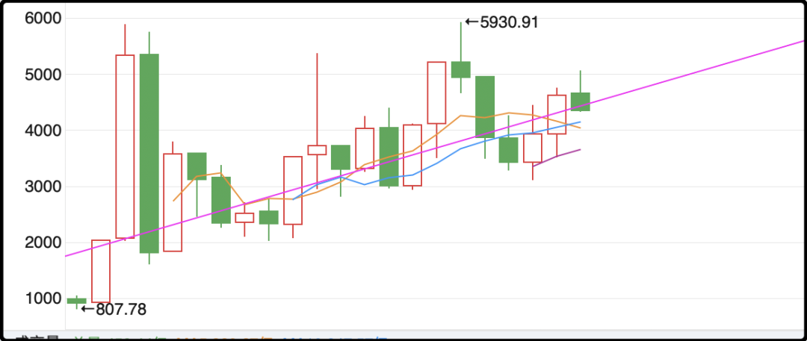

# 命够硬

今天开始诺奖的颁奖季了，第一天出的是医学奖，三人获奖，两个年纪大的德国人（71岁、73岁），一个年轻的美国人（54岁，图片里左边那位）。

他们获奖成果是光遗传学，可以用光精准控制大脑功能。我不是专家，我只能把我理解的用我的话说给你们听。

简单讲就是2000年的时候两位德国科学家，在藻类上发现了一个可以用光控制的神经开关，2005年那个美国科学家把这个开关的基因植入了大脑，从此就可以用光来控制大脑内的各个区域，并测试每一个区域具体功能（记忆、害怕、愤怒、成瘾等）

它有什么用？辅助研究抑郁症、阿尔茨海默症、帕金森症、精神分裂症，另外美国那边已经研发出一种光遗传学的注射药剂，通过刺激大脑神经，能让失明的人恢复部分视力。这个药上个月（2926.9）已经向FDA申请上市，即将临床落地。

我本来以为这几年很火的“脑机概念”也是光遗传学领域，但问过ai后说不是，是另一个分支的技术，那就没法当成概念去炒了。

说实话我在搜索资料时最大的感慨是2000年就发现的东西，到2026年才颁奖，诺奖官方对此的解释是新东西出来需要时间验证，只有被实践证明对人类有帮助的技术才能得奖。

那要是在等待实践证明的过程中死了呢？那诺奖就和你无缘了，因为规则规定获奖者必须还在世，历史上就有不少科学家因为死的早，导致奖项旁落他人。

像光遗传学这样的大学科，有几十名、上百名科学家都参与其中并做出贡献，这次获奖的只是组委会综合认定贡献最大的top3，要是这3人有死掉了，那就安排top4、top5递补。

所以想要获得诺贝尔奖，首先你得命硬，活得够久。

……

这几天有不少读者留言问长投a股的事，我说年化收益率5%让他们感兴趣，因为现在存款利率和保险利率都低的可怜，房价也持续阴跌，钱实在没去处只能考虑来a股。

首先年化5%确实是有的，至少过去二三十年a股的中枢就是以这个速度缓慢上移的，未来如何我无法保证，暂时先假设这个趋势不会发生改变。

我贴一下沪深300和中证500的年k线，图里面那条紫线是我画的，大致代表了波动中枢，能看到整体上还是逐年向上的。（上图中证500、下图沪深300）

你最好的买点当然是在紫线下面，这样除了年化5%的正常收益外，还有额外抄底的红利。而在紫线之上的买点都是不太理想的介入时机，一旦你在牛市高位进去，就很可能要折损好几年的利润进去。沪深300一直到2026年都没有填平2007年挖的坑。

那现在呢？现在属于不贵也不便宜的位置，无论是沪深300还是中证500都在紫线附近，如果是新手的话我不建议这个位置重仓介入，因为过几年熊市周期来了大概率还要挖坑，到时候你浮亏10-20%，连着三四年没挣到钱，心里会挺难受的，免不了会把自己所有的遭遇都赖到我头上。

有一点我要强调，以上分析仅限于你投资指数基金，就是买沪深300etf，或者中证500etf，大概是这个前景预期。如果你自己买个股的话方差会很大，祸福自便。

……

这几天蔡康永踩线了，现场出席了绿营活动，在网上被喷麻了。有人又翻出了他父亲蔡天铎和太平轮的往事，指责当年逃避赔偿责任，我对这个事件挺好奇，下午翻查了两个多小时，给你分享一下简单摘要。

太平轮是1949年1月27日出事的，是一艘上海开往基隆的船，当时国民党实行海上宵禁，商船怕被军舰查扣都是关闭航灯，摸黑快驶，结果夜里11点钟和一艘运煤船撞了，不到一个小时两艘船都沉了。

这船原本计划运500乘客，但1949年国民党败相已现，很多人恐慌逃向台湾，船票爆炒涨价，最后太平轮竟然涌上了900人，还超载了各种货物。

最后这900人大部分都被淹死或者冻死，1月初的东海很冷的，只有少数人爬到木桶和木板上熬到了救援，大概早上五六点的时候一艘澳大利亚军舰赶到，捞上来36人。

事后为太平轮承保的保险公司恶意倒闭，老板卷款跑路了，所有赔偿责任都压在船运公司中联轮船上。蔡康永的父亲蔡天铎是中联轮船的五位股东之一，不是大股东，具体占比多少网上查不到。

当时5位股东有4位已经离开大陆，只有周庆云还在上海，应对赔偿事宜。

赔偿标准说出来挺让人心酸的，大致就是一条人命80石米，因为那个时候货币已经崩溃，受害者家属都不愿意要钱，宁愿要实物大米。但就这80石米也没有赔偿到位，因为官司打到一半上海解放了，国民党政府倒台了，无论是受害者家属还是当事人，都被打散了，有些留在大陆，有些流落台湾，两岸就此隔绝。

大陆这边周庆云一家自然是走不了了，倾家荡产赔偿，周庆云死后家人继续赔偿，据说一直赔到80年代初才把欠债还清。台湾那边中联轮船倒闭，资产清算，赔多少算多少，后面也就不了了之了。

蔡天铎的航运事业完蛋，重操旧业当律师，东山再起日子才慢慢好起来。

今晚就聊这些吧。

作者: 猫笔刀

查看原文 →
