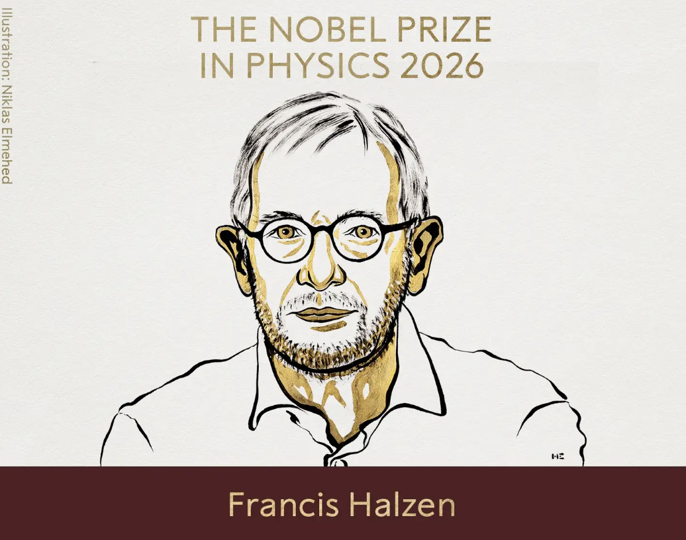
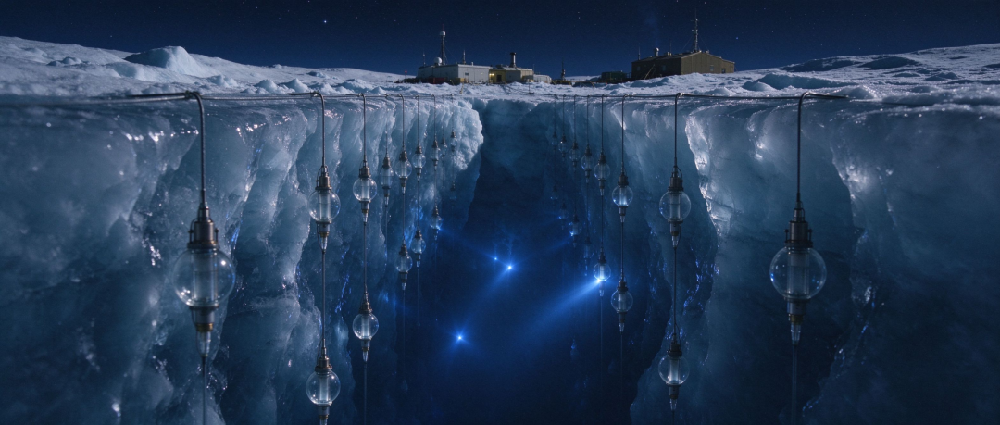

# 疯狂计划

我昨天感慨了一句现在四十几岁出去找工作大概率没人要，后台几百个读者留言让我立刻马上出去找工作试试，我看出来了这些人全都妹安好心，一个个其实就是想看我海投简历然后出丑。

我如果以私募基金合伙人或者财经大v的身份出去找工作，那指定是不难的，但这样还找屁工作，我坐家里就行了。我其实更想知道的是一个43岁的普通中年人，在当下社会求职大概是一个什么样的行情。

我把我的情况和agent说了一下，它直接回答我难度是地狱级的，极大概率除了铁人三项和吉祥三宝外找不到工作，它说我最大的问题是在简历写不清楚31岁-43岁这12年在干嘛，正常人这12年是职业生涯黄金期，不可能一片空白。我如果刻意隐瞒投资和自媒体经历，对方肯定会起疑我是不是做了什么见不得光的事情，比如坐牢之类的，正规企业不敢要。

随便说几个公司上班是不行的，对方一做背调就露馅。那我说自己私募基金创业失败，公司关了出来找工作，它说那情况会好很多，只要说清楚失败的原因，不是职业道德或者违规之类的问题，会有机构愿意给出岗位，只是起步薪资不要期望太高，2-3万区间。

其实我觉得不做投资，以我搜集信息、学习整合、以及熟练调用ai的能力，我在很多公司都能胜任内容工作，市场宣发，高级销售，当个项目经理应该可以的吧，我现在脑子挺好使的，比年轻的自己更聪明也更成熟。只是国内职场普遍职场有35+歧视，默认你超过40就不行了。

最后要澄清一下，我其实上着班的，在我自己的公司管了好几个产品，收益率凑合也过的去，每个月领工资也交社保，只是不坐班而已。

……

今天诺贝尔物理学奖揭晓了，竟然很罕见的没有三黄蛋，美国威斯康星大学的弗朗西斯・哈尔岑（Francis Halzen，今年 82 岁）一人独得 2026 诺贝尔物理学奖。

他的成就是主导创建了冰立方中微子天文台，有史以来第一次捕捉到了高能中微子，是不是看到这两句话头就麻了，不是天文物理发烧友根本看不懂。但我搜索学习了一下，觉得这个老头的故事很有趣，一定要和你们聊聊。

中微子在宇宙里广泛存在，但是极难捕捉，人类科学家想尽各种方案尝试，大致方向是建立一个巨大巨大的探测器，除了体积大还要有透明的介质去屏蔽地表噪音信号，探测环境要足够安静。

人类科学家想过在深海、湖底、人造水池、矿井建探测器的方案，都因为各种原因失败，直到1988年，这次得奖的这哥们想出了一个更离谱的方案：在南极冰层钻上千米的洞，把探测器矩阵埋进去。

上面这张概念图可以点击放大，放大看很震撼。

这在当年听起来太过科幻，大家都不信，但哈尔岑坚持要做，他找美国国家科学基金会（NSF）申请到了经费，从1993年开始在南极钻洞做小范围试验，确定工程可行后NSF分阶段追加投入。

最终耗资2.8亿美元，在南极钻了86个2500米深的洞，把探测器埋进去，探测范围是1立方公里的冰块，整个工程在2011年完成。

结果没等多久，2014年探测器真就捕捉到了中微子。

可能有读者会问捕捉到中微子有什么用？高能中微子是黑洞、恒星爆炸产生的，直线移动，不会拐弯，所以观测到高能中微子就可以溯源找到黑洞、恒星爆炸。

要是你再问一句找到黑洞和恒星爆炸有什么用，那我就不知道怎么回答了，对买房买车，结婚生子，考公务员没帮助，这种事暂时只能让有钱有闲有科学理想的人去做。

哦对了，有个事很有意思，哈尔岑主导建立了人类在南极最贵的工程，但他这辈子一次南极都没去过，这是不是和大家印象中苦哈哈的科研人员形象相去甚远。

本来这次有不少媒体预测中国薛其坤院士有机会获奖，他多年稳定在诺奖候选名单，凝聚态物理大热门。我查了一下薛院士今年62岁，希望他一定要保重身体，只要健健康康的，中国本土第一个诺贝尔物理学奖我们肯定能等到

……

今天有朋友问我，说阿里那个数学比赛是不是好几年没办了。我说是哦，去查了一下，中专少女天才事件过去已经两年了，本来一年一届的阿里数学比赛再无音信，大概是权衡社会影响和企业利弊后无限期暂停了。

至于那位女主角，有媒体报道已经从中专考上大学，生活低调，那就不再打扰了。

今晚就聊这些，假期余额不足，诸位记得充值啊。

作者: 猫笔刀

查看原文 →
