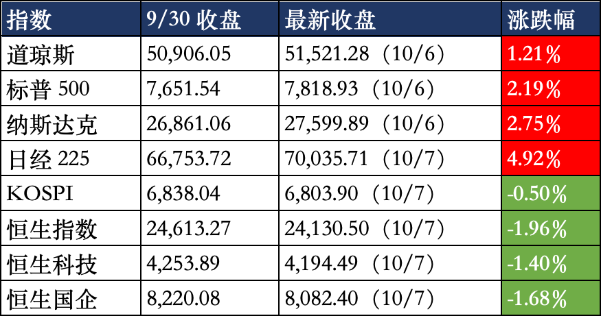
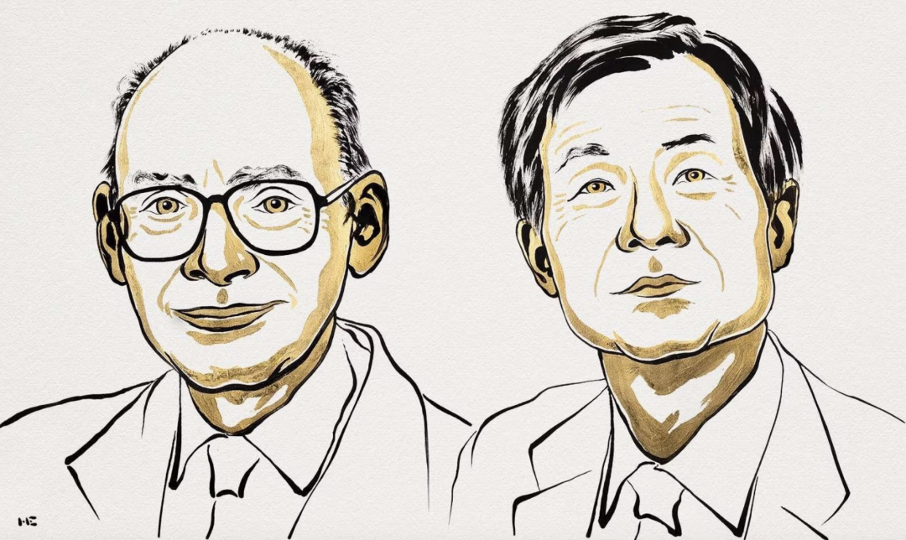

# 歇够了，开搞

长假结束了，明天要上班了，诸位是否已经迫不及待。我这里还有两个好消息要和你们讲，一个是10月10日（本周六）要补班，另一个是2026年的法定节假日已经全部休完了，双喜临门呐家人们

收收心，明天也要开盘了，把长假期间少的课补一下，首先看一下长假期间外围股市的表现：

美股港股表现是相反的，从历史经验来看美股是隔壁老王，有影响但不直接，港股早年是干儿子，最近些年含中量飙升后已经是亲儿子，所以整体影响偏负面，明天a股小幅低开的概率最大。

长假期间布油价格累计跌2%，国际黄金价格累计跌0.9%，都是以我写文章这会（10月7日晚8点）的统计。

美国这几天更新了一些经济数据，具体我懒得贴了，我只需要告诉你们两个结论，链上赌池认为10月份不加息的概率是83%，认为12月份加息0.25%的概率是75%，所以这个月不加息，两个月后加息是最新的共识。

看完上面这些数据后你对这7天的资本市场波动就有大的概念了，略微偏空，整体变化不大，但这只能代表开盘区间不会偏离很多，开盘后的交易方向是有可能出现大幅波动的，毕竟节前蛰伏了很长时间，如今长假结束，不确定性因素消除，很多休息够了的资金会开始展开操作。

……

1、今晚揭晓的诺贝尔化学奖，给了卡根（法国）和硖合宪三（日本），表彰他们发现了不对称有机合成中发现非线性效应和自催化现象。通俗解释一下，就是氨基酸在合成时会随机出现两种形态，左旋是可以治病的药，右旋就是杀人的毒药。上世纪70年代的时候卡根发明了一种办法，使得随机结果大面积倾向左旋，到了90年代硖合宪三改进了方法，使得合成氨基酸100%左旋，这个研究对于人类低成本生产药物很重要。

卡根今年96岁，比昨天的哈尔岑还要老十几岁，他的研究成果是半个世纪前出的，一直等到今天才获奖，恭喜他，让他等到了，活着才能赢，死了就啥都没了。硖合宪三是日本第29位诺奖得主。

2、中国央行连续第23个月增持黄金，上个月买了23.02吨，还在加速增持。去年每个月就买1吨左右，从今年3月开始加速增持，5吨、9吨、14吨、20吨，现在每个月买的比去年一年买的都还多。中国政府目前持续的用美债置换黄金，我觉得也是为未来的地缘冲突风险做预案。这不会影响我的判断，我自己配置黄金的计划该买就买，10月3日的文章已经详细阐述过了。

3、赛力斯宣布与华为达成新的5年合作，但不改变产销以赛力斯主导的模式，只说了联合组建问界专属业务团队，共同推进车型开发。赛力斯的股东也不用太高兴，港股那边这几天都在交易，消息出来后短暂冲高+16%，当天就回落到+6%，之后几天没啥变化。这只是个小利好，不足以让赛力斯摆脱目前困境。

4、国庆7天人群跨区域流动21.3亿人次，几乎和去年持平，没啥增量。另外人均消费弱，消费概念没有热度。国庆档电影票房截止今晚8点是11.5亿，比不上去年的18亿，更比不上前年的21亿，是最近10年最低数据。

5、长假期间存储概念的热度在上升，有两件事。一个是美光科技的业绩大涨，营收542亿美元，同比+379%，净利润377亿美金，同比+1077%，毛利率87%，大超市场预期，ceo称2027-2028年都看不到周期拐点。

另一个事是台湾生产DRAM的南亚科技通知客户涨价20%，这也反映了市场需求之强劲。

a股的存储板块7月份回调后就一直没缓过来，作为龙头的长鑫科技一直在弱势震荡，这和它开盘后直接起高价有关，透支了估值空间。但长鑫的限售股锁的比较狠，真正意义上的大面积解禁要3年后，所以一时半会也不会估值回调。

6、腾讯租赁甲骨文公司部署在东南亚的算力，时间5年，总合同规模是70亿美元。预付30%，已经体现在腾讯二季度财报，造成当期自由现金流转负。这些算力芯片放在东南亚，不进入中国境内，腾讯只是远程调用，这样就规避了美国的芯片出口管制。不过接下来美国可能对这种算力交易也会出政策禁止，所以这笔70亿美元的合同也有风险。

7、俄罗斯鼠疫出现两例死亡案例，近200人隔离调查，这事暂时还不会在资本层面形成明显影响，先保持观察，要是死亡人数上升或者传染范围扩大，对疫苗板块是利好呢。

差不多就这些，又写了两个月，照例征一次稿费，老规矩，给不给随你，给多少随你高兴，不给也不耽误继续看，给了也没啥额外福利。如果你觉得我每晚写的还行打个1元支持下我，谢谢了。

作者: 猫笔刀

查看原文 →
