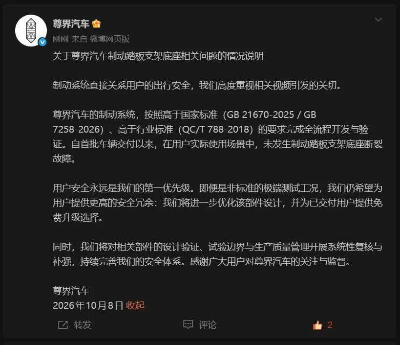

# 砸人饭碗，如

今天一早就有劲爆重磅，懂车帝发布最新的评测视频，华为和江淮汽车合作生产的尊界v800汽车被测试紧急制动时，发生了刹车踏板支架断裂的问题。先后测试了3台新车，3台车的刹车踏板都被踩断了。

我早上看视频的时候人都傻了，刹车板被踩断令我惊讶程度80%，懂车帝敢直接捅华为和江淮马蜂窝的行为才让我200%惊讶。汽车评测是高危敏感领域，尤其评测结果呈负面，那无异于砸车企饭碗，背后涉及巨大利益，很容易结仇无法善了。

前两年b站上有一个粉丝百万的汽车博主，做了极氪汽车和小米汽车的碰撞测试，视频播放300多万，后来被查出来部分细节造假，被抓进去了，我查了下海淀法院7月份刚判的，损害商品声誉罪，有期徒刑1年8个月。

我说这件事是想告诉你们，汽车评测不是普通内容，你说厂家坏话必须有铁证实锤，但凡评测内容被人发现瑕疵，华为和江淮是不会放过你的。

具体到这次评测的内容，我就不描述了，因为我不开车不懂车，不专业，描述的过程中万一出了偏差，当事方可能还会来找我麻烦，你们自己去看。在各大平台搜索“懂车帝 尊界”关键词就行，或者问ai，大致就是高速行驶过程中用力踩刹车把刹车踩断了。

也不算大力金刚脚，视频里演示者是70多公斤的普通成年男性。我估计读者看到这里会有疑问，怎么没听说其他尊界客户把刹车踩断，偏偏懂车帝测试就连坏3个？

我觉得主要原因尊界V800是新车，定价80-100万，8月31日才开始首批交付，市场估计到目前为止交付出去的就几百台车。其次它是商务车，大部分车主买回去就正常开，可能很少涉及100公里以上时速+紧急刹车的场景。

受这次事件影响，江淮汽车上午就封死跌停，出这么大的舆情跌这点很正常，接下来要看车企是怎么应对的，选项有：澄清解释、起诉反击、认错道歉、产品召回、躺平冷处理，都有可能。

汽车整车受这件事影响今天也跌了2.3%，电动车可能是未来两三年竞争最残酷的行业，本来车企日子就不好过，再磕一下碰一下很可能就引爆矛盾。

……

今天是节后首个交易日，a股直接贴脸拉了个大的，杀最狠的还不是汽车，而是科技芯片，科创-4.8%，创业板-3.1%，直接把各大宽基指数都拖沟里去了。

最大利空来自大摩发了一篇最新研报，说美国FCC计划搞受控清单来限制中国光模块进口。简单说就是2028年要落地一个规则，3.2T光模块若想豁免卖到美国，物料65%必须来自美国本土厂商，所以到时候不能大量用中国产激光器光芯片，必须采购Lumentum、Coherent这类美国光芯片。

于是今天a股的光芯片就崩了，源杰科技、长光华芯20cm跌停，东山精密跌停，仕佳光子跌超15%、天孚通信7%，跌的麻麻的。因为跌太狠，市场还自己脑补其它鬼故事，说1.6T光芯片接下来要降价，进一步放大了市场恐慌。

你们应该也发现了，今天光模块龙头中际旭创跌3%不算多，因为它不生产光芯片，它是组装厂，理论上它可以不买国内芯片，转而采购美国芯片来规避这个政策，所以这次对中际旭创的冲击不大。

光模块一直是ai产业链里中国比较强的一环，但目前已经被美国惦记上了，他们最近接二连三的出主意进行限制和打压，未来政策面隔三差五的只有坏消息，不会有好事，这是悬在光模块股东头上的达摩克利斯之剑。

除了科技外今天创新药也崩了，据说是因为艾力斯伏美替尼全球三期临床失败，打击了市场对国产创新药出海的信心。艾力斯今天股价暴跌20%，他们在海外的合作伙伴ArriVent也很惨，美股股价跌了40%

总之感觉只要a股一开门，各种坏消息就来了，然后a股又是个易崩体质，利好反应迟钝，利空一点就炸，复工第一天就请大家吃熊掌，认栽了。

……

1、写文章这会尊界汽车已经正式回应了，优化部件设计，给老用户提供免费升级选择。

2、中国人民银行最新发了一篇文章阐述汇率政策立场，我翻译成人话就是人民币汇率主要交给市场决定，不会硬卡死某个固定数字；不会主动把人民币贬值来抢出口生意，但也绝不允许汇率短时间暴涨暴跌。

这个表态没什么方向性，涨了跌了都有可能，但明确拒绝暴涨暴跌。感觉和对a股的态度差不多，可以涨可以跌，但不能暴涨暴跌，只是a股没汇率那么好管，经常失控。

3、三星第三季度销售额195万亿韩元，增长127%，营业利润107.4万亿韩元，略微低于预估的108.7万亿，就低1%也有一些空头在那里挑刺，想砸盘的人永远不可能满意。

4、anthropic发布了一个便宜的模型haiku5.5，比上一个版本价格下调了75%，美国那边也开始玩价格战了。受此影响国内大模型智谱跌7.6%，minimax跌13%，不过这两屌毛股就算没有外部利空也有可能跌的比这还要狠。

智谱股价从高位回撤79%了，minimax回撤85%，之前有读者说智谱是个好公司，值2万亿，再等等就有1折促销了。

今晚就这些吧，我昨晚忘记开稿费，结果今天跌的这么难看，运气也是差，一般行情不好愿意给1元的人会少，不过我也不是收完这一次就卷铺盖跑路了，我是打算写到2050年的，行情有好有差，撞到哪天算哪天

作者: 猫笔刀

查看原文 →
