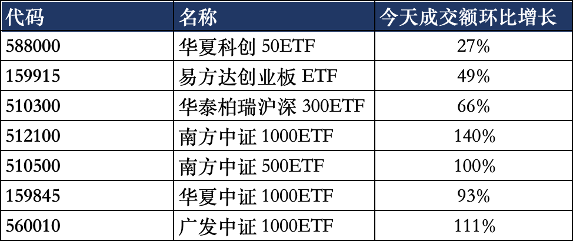

# 真刺激

这周特别短，才两个交易日就完事了。

今天a股也是经历了大起大落，11点那会普跌2%左右，午休前突然被一股力量给拉上来，下午一路反弹完成了大逆转，几乎所有指数在收盘前都勉强翻红，算是一个happy ending，没让股民吃大面过周末。

惊天大逆转总要找原因的，盘后大量媒体都指向了一件事，即今天宽基ETF爆量，尤其是上午中证500、中证1000、双创的ETf成交活跃，暗示有大资金入场抄底维稳才导致了a股深V翻盘。

我复盘的时候把这几个ETF的分时线都翻出来看，没看到以前国家队抄底特有的量柱特征，但确实今天普遍放量了。

其实更关键的数据是ETF的净申赎数据，但这个是T+1披露，要下周一才知道今天到底有多少资金入场ETF。话说ETF申赎数据也是目前为数不多有观察价值的公开数据了，年初官军减持就是从净赎出数据里看出来的，没准哪天就像南北向数据一样突然就没了。

今年上半年宽基指数表现很好，科创50一度涨到67%，创业板涨36%，中证500涨22%，结果最近几个月全都崩了，除了科创50还有8%涨幅，剩下的宽指今年全绿了。

但有意思的是，上半年个股普跌，市场中位数最低到过-16%，最近3个月反而反弹到了-12%，说明这3个月市场的主线是资金从指数权重板块（科技ai）里流出，回补到了非指数的小市值股。

6月底那会，宽基指数年内跑赢市场中位数超过30%，现如今跑赢幅度缩水到6-7%。

我持有期指，原先上半年还挺美，散户亏十几个点的时候我还赚25%左右。经过这几个月的劫富济贫，我也被拖下粪坑一起吃屎，年内盈利所剩无几。

在a股没有均富卡，只有均贫卡

……

昨天的汽车评测风波也更新一下。

懂车帝关于尊界v800踩断刹车的视频已经全网下架了，b站、微博、抖音、视频号都看不了了。懂车帝客服对外口径：暂未收到相关下架通知，没有说明是自己删，还是平台下架。

今天有很多人传鸿蒙手机无法打开懂车帝视频，这个被辟谣了，是因为系统没有适配关联视频平台导致。

还有一张内部通报的截图在社交媒体上传，说懂车帝因为不正当竞争被立案调查，已经辟谣是假的。那张图是用ai做的，公章上的字都乱码了，现在有了ai工具后，视频和图片都不能尽信。

江淮汽车股票今天大部分时间都处在跌停状态，下午随着大盘反弹终于撬板成功，最终收跌8%。

……

还有关于我不开车的事，我其实是有驾照的，2008年在东方时尚驾校考的，当年就买上车了，过年车票不好买还打算自己开车回家。结果2008年南方雪灾你们有印象吗，高速公路上厚厚的积雪，我小心翼翼的开，时速大概50-60km。

结果前车打滑了，撞到护栏上后在路上来回反弹，弹到我车道的时候躲不开就怼上了，当时安全气囊都弹出来，车里面一股爆米花的味道。

交警判了对方主责，我次责，这次事故后我就再也不开车了，家里都是老婆当司机。我开车容易走神，犯困的时候忍不住想睡觉，家人都觉得让我继续开车迟早要闯大祸。但其实高速撞车那次我觉得我没做错什么，我在自己车道正常行驶，我开的也不快（地上有雪），对方车弹过来了根本躲不开。

快20年没摸方向盘，我现在肯定一点也不会开了，驾照倒是养的棒棒的，年年零违章记录。日常出行就是打滴滴，很方便，坐后排玩手机，困了就眯一会，我觉得挺好。

去年有一家新能源厂商找上我，想要商务合作，让我给他们写软文，他们送我汽车。我说没法接，这等于找葛优代言卖洗发水，老读者都知道我不会开车，我给汽车产品说好话属实滑稽。

哦对了，还有个细节，我是在徐州段撞的，车放到交警队的停车场一段时间，结果后来去提车的时候发现车载音响被人偷拆走了，我们为这事投诉抗议，最后赔了2000还是3000我忘了。因为这件事我对徐州印象不好，交警队里面手脚都不干净，这也太无语了。

今晚就闲聊这些，最后感谢一下昨晚给我打赏稿费的读者大人们，感谢感谢，全仗着诸位走面了

作者: 猫笔刀

查看原文 →
