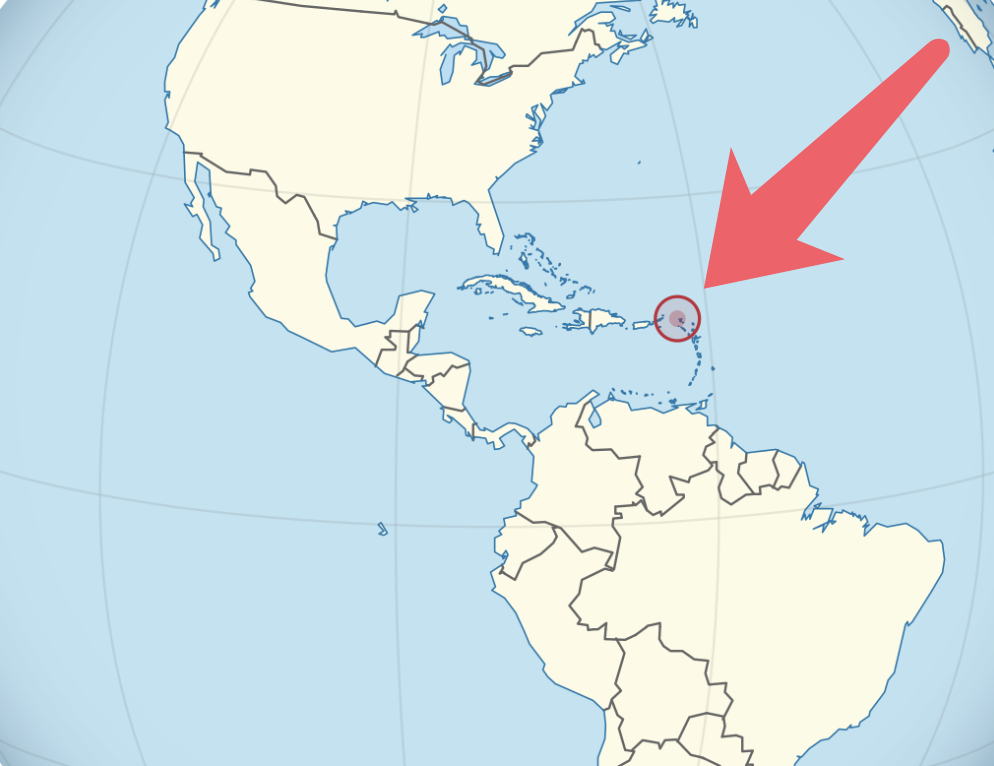
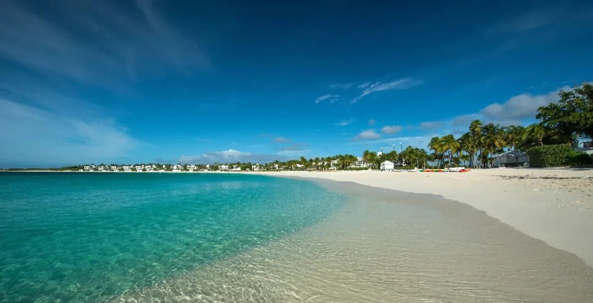
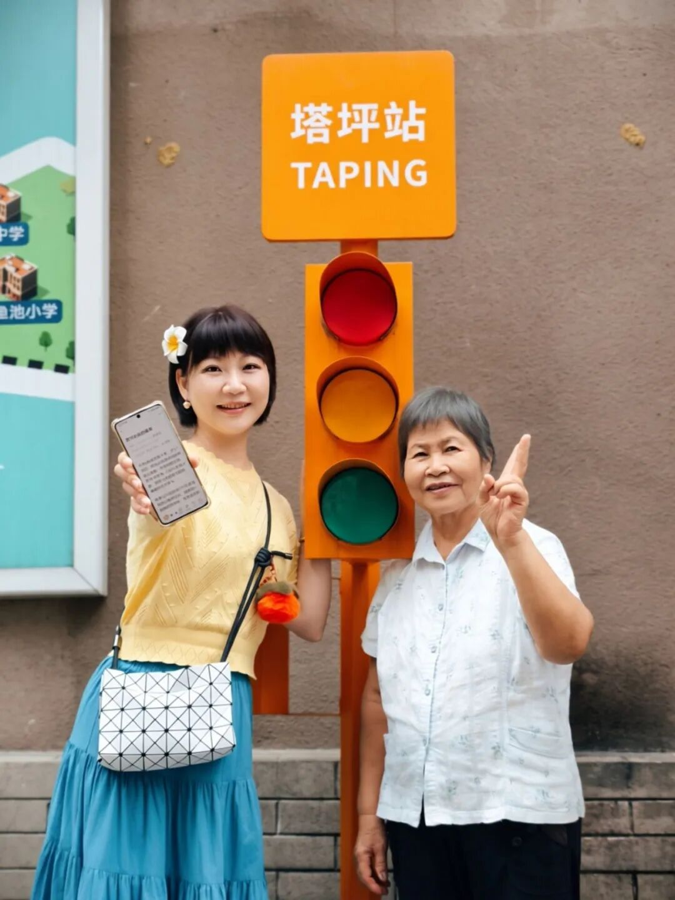
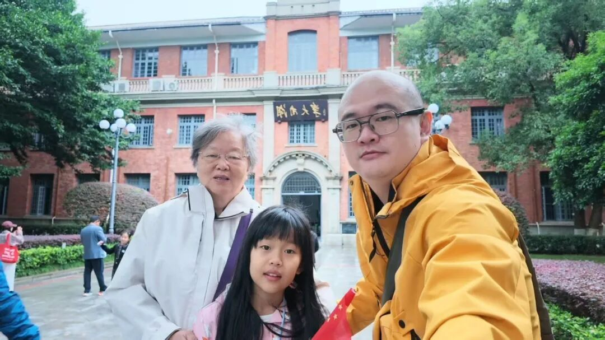
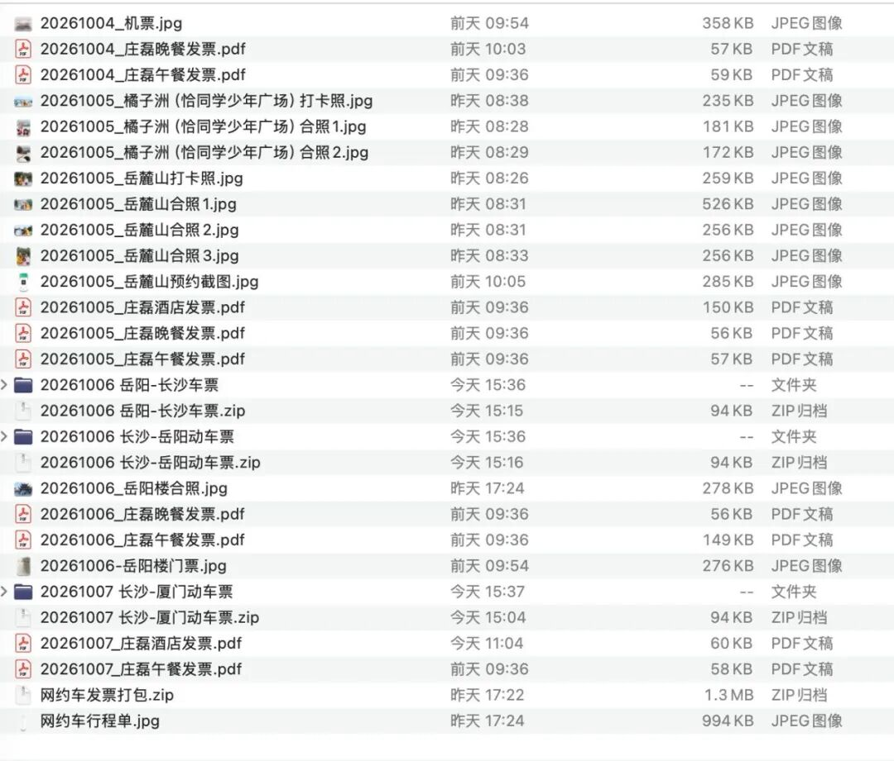

# 服了，还有这种横财

周末咱就随便闲聊哈，想到哪聊到哪。

我今天知道了一个很好玩的事情，在加勒比海上有一个叫安圭拉的小岛，在美国的东南边，古巴的边上。安圭拉岛很狭长，大概26公里，最宽的地方也不足5公里，岛上居住着1.6万人。

这样一个偏僻海岛这几年发横财了，因为他们上世纪加入了ISO国际编码表，所以IANA（互联网号码分配局）在1995年分给他们国家代码域名后缀是.ai

看到这里，你们能猜到他们为什么发横财了吧

这几年ai太火了，大量ai公司申请了.ai的后缀域名，比如anthropic给模型申请的网络域名就是claude.ai，马斯克给自家模型申请的域名是x.ai。每一次域名注册，以及后续的域名维护，都要给安圭拉政府交一笔钱，少数高价值域名公开拍卖，溢价也归属安圭拉政府。

这样零零碎碎下来，一年增收约9000万美元，还在逐年增长。这对于安圭拉岛来说是一笔巨款，占了当地政府全年预算的一半。

我好奇他们突然暴富会用这笔钱干嘛，查了一下主要是先偿还高息政府债，给本地居民减税，扩建升级本地飞机场，这样大型客机就能降落，吸引更多美国游客，给儿童老人免费医疗，增加学校，给警察加工资，提升社会治安。最后还有结余成立主权基金，长期投资。

这么看非常合适，黑人为主（85%）的岛民群体能有这治理水平不多见，我顺带多了解了下安圭拉的情况，他们人均gdp接近3万美元，人均可支配收入是中国的两倍，有些小意外。

岛上的支柱产业是旅游，而且是小众高端游。安圭拉有一个独特优势，他们是英国自治领，国防、外交、法治有英国背书，所以欧美富豪愿意去那里度假。我们中国人如果要去那里玩一个星期的话，预算5万起。

别看岛民就1.6万，也有体育明星。英国100米纪录9.83保持者扎内尔休斯就是安圭拉本地人。我们中国观众其实早就看过他了，苏炳添东京奥运会百米决赛，第一枪有人抢跑被罚下去了还有印象吗，对，那个被罚下去的倒霉蛋就是扎内尔休斯

……

昨天诺贝尔和平奖揭晓，得奖的是一个南非人权女律师，以前还当过国际刑事法院的法官。坦率讲我不熟悉这人，对她的成就也一无所知，我关注诺贝尔主要看物理、化学、医药这三个单项，文学奖和和平奖在我心里面含金量要差一些，因为主观层面的影响因素太多。

尤其是和平奖，历史上曾经两次颁给中国人，都不是正面案例，国内高度敏感，不能聊的。

这次和平奖颁发结果出来后把一个耄耋老人惹急了，特朗普专门发了一个巨长的帖子公开抨击，说不认识得奖者，是个没有名气的神秘人。他认为这个决定shameful and embarrassing（可耻尴尬），会给挪威留下抹不掉的污点，说和平奖已经被一群反民主、反文明的人毁掉了。

他说自己才配获得和平奖，因为他制止了8场战争：

以色列–哈马斯（加沙）：特朗普称促成停火、释放人质以色列–伊朗：2025 年双方 12 天的相互打击后停火亚美尼亚–阿塞拜疆：纳卡地区冲突印度–巴基斯坦：特朗普自称介入调停刚果（金）–卢旺达：M23 叛军相关的边境战火塞尔维亚–科索沃：长期主权对峙埃及–埃塞俄比亚：两国外交纠纷，没打仗柬埔寨–泰国：2025 再度爆发边境冲突后达成停火

这里插一句，他公开吹嘘自己的功绩，美国媒体没惯着他，美联社和cnn都有评论，说有的战争本来就是他发起的，有的战争只是外交冲突，本来也没打起来，有些战争是双方谈判，没承认和他有关，还有些战争只是临时停火，并没有停战。

总而言之，特朗普说的这段话掺了不少水分。

至于特朗普自己发动的对伊朗的军事打击，他说这是避免伊朗拥有核武器，保护了中东和世界的安全。老头太会说话了，没打的是因为他，他自己打的是保护大家

完了他还撂下一句狠话，“Norway, we will not forget.”

挪威，我们不会忘了这茬。

80岁的人了气性还这么大，太逗了，其实去年没发给他就很生气，反而是当时得奖者说要把奖杯转赠给特朗普，一场闹剧。说实话我也觉得和平奖本身就有些扯犊子，降低了诺贝尔奖整体的逼格。

……

之前带父母旅行的中奖读者最近陆续开始返回照片了，今天给大家发两套：

这个姐妹是带着母亲去了一趟重庆旅行，母女两的眉眼很像。一组照片拍的很好，又清晰又有美感，我发现个规律，女读者提交回来的照片都很精致，大概是觉得要上公众号得好好拍。男读者提交回来的照片...都很钢铁，你们懂的。

这是一位男读者带着母亲和女儿去长沙玩了，拍照的位置我熟，我去年看蔡依林演唱会的时候也去过岳麓书院，这里就是书院门口的长沙大学。祖孙三代的相貌也很有渊源，肉眼可见的血缘关系。

这位男读者最有趣的是他提交给小助理的文件包，当时打开的时候我们几个都笑了，我说这兄弟平时上班一定是个严谨勤恳的人，连旅游抽奖活动都汇报的井井有条，工作上更不用说了。小助理收到文件后直接给他打钱，他还很意外，不是七个工作日吗？哈哈哈，我们这里是草台班子，差不多就行，哥们要注意，不要班味太浓了

就这些，发了。

作者: 猫笔刀

查看原文 →
